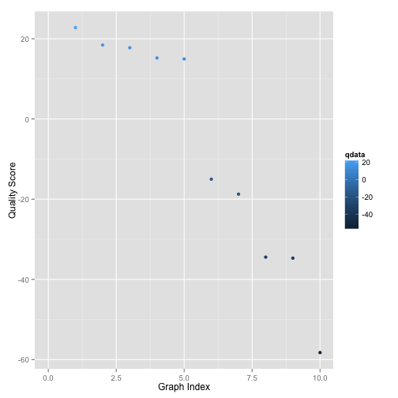
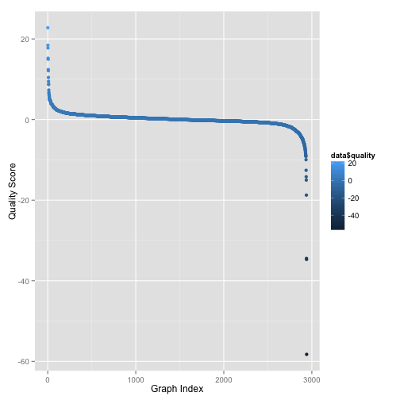
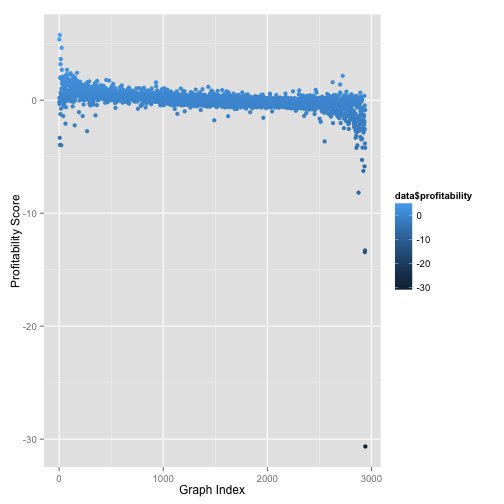

Quality Minus Junk
========================================================
author: Ryan Kwon and Anthoney Tsou
date: January 27, 2015

What is Quality Minus Junk?
========================================================

Quality Minus Junk, or QMJ, is a strategy that focuses on
the quality of stocks rather than prices. The price approach 
is the more conventional method of buying low and selling high. 
QMJ instead focuses on going long, or keeping, high-quality stocks 
and shorting, or selling, low-quality stocks.

The Purpose of qmj
========================================================
Our package, qmj, is an implementation of AQR's paper, 
$Quality \  Minus \ Junk$. However, AQR only looks into historical
portfolios, whereas qmj provides free software for measuring the 
quality of stocks in today's market, or as close to today as we 
can get given publicly available information, and can be easily
updated to have the most recent information.

Using qmj, Help Files
========================================================

```r
library(qmj)
help(package = "qmj")
```

Measuring Quality
========================================================

We will take a look at one of our vignettes.

Collecting Data
========================================================


```r
#get_info()
financials <- collect_market_data()
```

- get_info() will grab financial information from balance sheets, income statements, and cash flows. 

- collect_market_data() calls the functions in qmj that separately calculate profitability, growth, safety, and payouts, organizing stocks by descending order of quality. 

Viewing Data
========================================================

```r
#head(financials,10)
```

Viewing Data Cont'd
========================================================

```r
graph_portfolio()
```

 

```
   ticker quality
1    ANGI   22.78
2     BRC   18.44
3    UHAL   17.76
4    GUID   15.21
5     BRO   14.97
6     ROL  -15.02
7    SYRG  -18.75
8     AWH  -34.45
9     HVT  -34.70
10   HPTX  -58.26
```

Viewing Data Cont'd
========================================================

```r
graph_portfolio(type = "quality")
```

 

```
     ticker    quality
1      ANGI  22.780429
2       BRC  18.444257
3      UHAL  17.762068
4      GUID  15.210004
5       BRO  14.965623
6      UTMD  12.397505
7      CFFN  12.112361
8        PM  10.450565
9      GOOG   9.467265
10       KO   8.758112
11     CENX   8.716363
12     POZN   7.334352
13      BXS   6.760311
14      PFG   6.490578
15      ASC   6.082561
16      RSE   6.071340
17     PDCO   6.010687
18      LAZ   5.808107
19     NRIM   5.538341
20      EMC   5.252414
21     FDML   5.066322
22      BYI   4.990874
23      GCA   4.883409
24     TSLA   4.818846
25      HZO   4.777543
26     CMCO   4.772519
27     CALD   4.753267
28     MTSC   4.711210
29      AIG   4.700246
30     ADMS   4.641429
31      HSH   4.534472
32      PBF   4.500827
33     KTWO   4.495917
34      NHI   4.477504
35     OPLK   4.111517
36      UTX   4.061361
37     NBBC   4.025720
38     FIVE   4.020300
39     BURL   4.009586
40      CYS   3.933290
41     MXWL   3.904853
42     ARUN   3.858553
43       ED   3.852732
44      VLO   3.798720
45      SXT   3.797543
46     WIFI   3.760452
47      WMT   3.740245
48      CXW   3.727604
49     SGBK   3.712191
50     ORCL   3.678949
51     PCCC   3.666914
52      ETM   3.646375
53      LYB   3.571343
54     HASI   3.565618
55      MCD   3.562166
56     FLDM   3.448033
57     RVLT   3.430919
58      HRS   3.397587
59      PRU   3.392489
60     PLAB   3.367767
61     STCK   3.307279
62     IPHI   3.300396
63      RWT   3.240952
64     BMTC   3.238346
65      DUK   3.171168
66      EPE   3.099861
67      WSO   3.038947
68      MTH   3.022407
69     GBCI   3.020439
70     KATE   2.974759
71     NVDA   2.964820
72     SBAC   2.960722
73     TREX   2.937748
74     FSLR   2.934500
75    VLCCF   2.930402
76     NBCB   2.923258
77      TJX   2.919788
78       PL   2.848446
79       UA   2.833152
80       KN   2.802894
81       VZ   2.796301
82     CTRL   2.781033
83     CERN   2.745187
84       PG   2.734323
85     TXRH   2.728902
86     PEGI   2.720053
87       MS   2.683785
88     IPXL   2.676890
89     HMST   2.638923
90     VRSN   2.626687
91      EOG   2.608126
92      QTM   2.601509
93      PEP   2.590875
94     JONE   2.529377
95     PNFP   2.492610
96     FWRD   2.456121
97       RE   2.454777
98        V   2.454428
99      BHE   2.453607
100    EVTC   2.431210
101    EZPW   2.421901
102    TWTC   2.415879
103    IRET   2.399024
104    THLD   2.387064
105    REXX   2.381655
106    CRAY   2.371272
107    SQBG   2.366936
108    QUIK   2.363183
109    BECN   2.349015
110    FRSH   2.347567
111      NM   2.340176
112      GB   2.321899
113      DK   2.319958
114     FGL   2.307443
115    NDLS   2.296547
116     AWK   2.293528
117     COH   2.269876
118    RSPP   2.259134
119     CCE   2.258785
120     AEP   2.256581
121     BZH   2.210742
122     RGC   2.205155
123      LE   2.187959
124    AMAG   2.182899
125    AKAM   2.177210
126     AVT   2.165791
127    EVER   2.157980
128    UCBI   2.152985
129     RJF   2.148994
130     TRN   2.146699
131    KODK   2.140119
132    FTNT   2.123957
133    LION   2.122705
134      MA   2.116434
135     HTS   2.088719
136    BDBD   2.087956
137    LANC   2.087823
138    BCOV   2.083856
139   RUSHA   2.078121
140    ACRX   2.072293
141    NMRX   2.066990
142    CECE   2.064572
143    ARII   2.062395
144     TMK   2.056317
145      AF   2.049421
146    POWI   2.040682
147     HNR   2.028764
148     TRV   2.024698
149     WOR   2.021720
150      MD   2.010684
151    FISV   2.001197
152    NTLS   1.997573
153     MSO   1.992438
154      GD   1.978288
155    RUBI   1.975545
156    KAMN   1.972793
157   IMKTA   1.951744
158      GM   1.948936
159     EAC   1.931371
160    EGOV   1.929421
161     UNM   1.927841
162    BRKR   1.924837
163     KBH   1.899220
164    CYNO   1.888860
165      LQ   1.871772
166    TASR   1.870627
167     LLY   1.870007
168     TRI   1.863829
169     VRA   1.862450
170     SJW   1.859257
171     CAP   1.858108
172    MRIN   1.852860
173    CSBK   1.852528
174    CIEN   1.845111
175    STBZ   1.841906
176     TFM   1.829337
177    AMSG   1.829144
178     SWM   1.816827
179     BLT   1.799110
180    PATR   1.795757
181    FBNC   1.788868
182    LNKD   1.787723
183    USTR   1.769893
184    ALIM   1.765793
185     TNK   1.748904
186     EXP   1.747840
187    SALM   1.740364
188      RL   1.739428
189       P   1.729501
190     PRI   1.728376
191    SALE   1.728029
192     DDD   1.717783
193     HPY   1.709379
194    XXII   1.703773
195     MNK   1.701272
196    USAK   1.700655
197     LPX   1.700605
198     MRC   1.700038
199    INFI   1.693411
200     CPE   1.685741
201    REGI   1.683628
202    WEYS   1.665430
203    AMBR   1.664044
204    TROX   1.661964
205    HOMB   1.652199
206    BONT   1.643870
207    GILD   1.642888
208     EQT   1.640121
209    AXLL   1.637233
210    EVHC   1.637198
211    CONE   1.624562
212     EVR   1.619512
213    WYNN   1.617861
214    IBKR   1.610663
215      CE   1.608275
216     ENZ   1.595716
217     ARC   1.595204
218     GRA   1.582888
219    HLIT   1.578762
220      HD   1.577711
221    TLMR   1.575054
222    REXI   1.574353
223    INWK   1.573387
224     AVY   1.564559
225    QCOR   1.563400
226       Y   1.558389
227     ATO   1.546168
228     CAT   1.546069
229    CVGW   1.543818
230     HAR   1.541121
231    PHMD   1.536052
232     TRW   1.535919
233    ELNK   1.530518
234     NOC   1.530050
235     CVG   1.523939
236     WLT   1.523848
237     SLM   1.523113
238     INO   1.516603
239    CHEF   1.514435
240     SSI   1.512143
241    BLDR   1.507870
242    VSTM   1.506851
243    IGTE   1.503421
244     DXM   1.499835
245     BEE   1.497983
246    NAVB   1.493824
247     IPG   1.491001
248    SYUT   1.489884
249    SNBC   1.487389
250    NEWP   1.483596
251    WRES   1.482510
252     ONE   1.482430
253   CMCSA   1.482317
254     DTV   1.481353
255      LB   1.474477
256    EXTR   1.473888
257      DE   1.470105
258     PSB   1.466435
259    ABMD   1.463852
260    BRDR   1.461675
261     PFS   1.456707
262    EBIX   1.454699
263    SSYS   1.452477
264    NKTR   1.452059
265     FIS   1.451019
266     AZZ   1.447100
267    BBOX   1.445575
268     OAS   1.445508
269    LVLT   1.442716
270    ZNGA   1.439253
271    MSCI   1.430582
272   AMSWA   1.430220
273    ACLS   1.427683
274     MLR   1.427186
275       M   1.426522
276     CBB   1.422512
277    GCAP   1.420555
278     SCI   1.418641
279    PGTI   1.417526
280     EDE   1.417498
281    PZZA   1.414076
282    COST   1.411561
283    FARO   1.410787
284    NTRS   1.404622
285    TESO   1.400300
286    SIRO   1.399822
287    EOPN   1.396595
288     EGL   1.395813
289     AMC   1.393475
290    OREX   1.391746
291    HRTX   1.389023
292     TEX   1.388033
293    CALX   1.375189
294    OKSB   1.373736
295     FLS   1.372165
296   LVNTA   1.368927
297    SYKE   1.367769
298    DOOR   1.367441
299    FNLC   1.364662
300    MEAS   1.353133
301    NVAX   1.352872
302    BFAM   1.352218
303   KBALB   1.351318
304    FRGI   1.347355
305    DYAX   1.344771
306    APAM   1.340254
307    TRGP   1.339183
308     ITG   1.338026
309    LSTR   1.337448
310    RARE   1.335396
311    CUBI   1.335313
312     OFG   1.334917
313     AXS   1.333642
314    IXYS   1.329639
315    HSNI   1.323974
316    PAHC   1.323653
317    TPRE   1.320019
318     OPB   1.314715
319     HAL   1.314581
320     DAL   1.312632
321   GOOGL   1.307823
322     BPI   1.307145
323     PNC   1.305489
324     GBL   1.300452
325     RFP   1.299189
326     OEH   1.296478
327    INTC   1.296238
328    FFIV   1.294355
329     XEC   1.292283
330     PEG   1.291999
331     EXC   1.290390
332     MNR   1.288673
333     JWN   1.285234
334     TIS   1.279832
335    AAMC   1.277862
336     UCP   1.277858
337    COMM   1.272281
338    SREV   1.272192
339    RESI   1.266064
340     PWR   1.264565
341      SC   1.264506
342     UAL   1.254324
343    LSCC   1.251421
344     CNX   1.248627
345    PRTA   1.248592
346    PFSI   1.240150
347     AVD   1.237197
348    PACW   1.235481
349    ALKS   1.234577
350    TCBI   1.232656
351     DLX   1.232551
352     LNT   1.228220
353     JBT   1.223708
354    CALL   1.222488
355    LHCG   1.222275
356     UAM   1.220445
357     WAB   1.219942
358    SBRA   1.216820
359     MSG   1.215040
360     CUB   1.214196
361    AERI   1.210537
362      AP   1.208264
363     MCS   1.205599
364    LYTS   1.204050
365     AZO   1.202972
366    AFOP   1.201940
367    HUBG   1.201466
368     LNG   1.200767
369    RIGL   1.199601
370     STI   1.192869
371     CMS   1.190534
372    MILL   1.187742
373    HBHC   1.186071
374    CVGI   1.186032
375    JMBA   1.185758
376    NWLI   1.185598
377    FNHC   1.182929
378    HSII   1.182577
379    RPRX   1.179763
380     MDR   1.179293
381    SPLK   1.175555
382      AE   1.174733
383     MSA   1.174327
384    ANAC   1.173772
385     CMC   1.170310
386     SIX   1.169767
387    GEOS   1.169422
388     CVO   1.167960
389     YUM   1.167278
390    ARIA   1.166762
391      VG   1.163693
392    SPSC   1.160451
393    RALY   1.158282
394    LMNR   1.156312
395     WLK   1.148282
396    DIOD   1.144420
397     TPH   1.143803
398     LTC   1.143038
399     FII   1.140860
400     AAP   1.138398
401      RS   1.137059
402     IBM   1.135721
403    EROS   1.132187
404     KRA   1.129991
405     GNW   1.129494
406     GEO   1.129226
407     CTS   1.128590
408     EXL   1.119393
409    PAYC   1.118993
410    STRT   1.117920
411    STAA   1.117596
412     KND   1.116932
413    BRSS   1.111663
414    AMRS   1.110088
415    AREX   1.109576
416    ODFL   1.109334
417     CTT   1.108618
418     GIS   1.106950
419     SWN   1.105417
420     XCO   1.102256
421    CPLA   1.099386
422    NGHC   1.098844
423     MPO   1.096133
424     ATK   1.091995
425    COHU   1.089883
426     LKQ   1.087902
427     KAI   1.087796
428    BEBE   1.087525
429     OCR   1.080733
430    USMO   1.080541
431    BBBY   1.080031
432     BKE   1.078855
433     LPI   1.077752
434    SHLO   1.075670
435     UNS   1.074767
436     CYT   1.072648
437    PETM   1.072412
438     MWV   1.071165
439     SJM   1.070908
440    VIAS   1.070230
441    AMGN   1.067477
442    CRCM   1.064668
443     EBS   1.064217
444       D   1.063212
445     FCF   1.061537
446     TAT   1.059786
447     SPG   1.058501
448    PSTB   1.057315
449   MOG.A   1.054301
450    MCRL   1.052412
451     SUP   1.052139
452    INSY   1.052024
453     AHS   1.051243
454    CYTR   1.050576
455    JIVE   1.048288
456     HUN   1.047709
457     NHC   1.047548
458     SYK   1.046365
459     MCF   1.046218
460    FXCM   1.044512
461    SCMP   1.044494
462    PSIX   1.042295
463    FURX   1.041147
464     ANF   1.040836
465    WSFS   1.040039
466     DFZ   1.039407
467     KEY   1.039253
468     MTX   1.038878
469    THFF   1.038218
470     WRB   1.036911
471    SCSC   1.029133
472    JOUT   1.028551
473       T   1.027672
474    FRBK   1.027034
475     ROP   1.026916
476    AXAS   1.026294
477    RCPT   1.026006
478    DGII   1.025627
479    STAR   1.022443
480     GEF   1.019920
481     FUL   1.018998
482     OII   1.012669
483     LII   1.010257
484     CAG   1.007734
485    EBSB   1.006278
486     ESE   1.003195
487    COLB   1.002825
488    AMAT   1.002393
489    PINC   1.002220
490     CWH   1.000504
491    TRMK   0.999555
492     THS   0.997730
493    HALL   0.997621
494    UFPI   0.995682
495    ZION   0.995330
496     CEB   0.994172
497    WIBC   0.993200
498    SKYW   0.991619
499     GGP   0.990959
500    MRGE   0.990852
501    TTMI   0.990185
502    SBNY   0.988555
503    OPWR   0.987317
504     HAS   0.984421
505     COG   0.984082
506    KIRK   0.981347
507    ACET   0.981027
508     PFE   0.979154
509    LMIA   0.978224
510    TAST   0.977253
511    SCOR   0.977143
512     AMP   0.975890
513    IBTX   0.975782
514    ASEI   0.974645
515    CRUS   0.974578
516    DECK   0.972388
517     DSW   0.968208
518   DISCA   0.965363
519    CVEO   0.962475
520    APOG   0.959870
521     NNN   0.958817
522     DLB   0.958305
523    ARRY   0.957463
524    CLNE   0.955897
525    WERN   0.954806
526    DNDN   0.953205
527    RLYP   0.952817
528    COBZ   0.950517
529    NFBK   0.950222
530    NCMI   0.938275
531    CCNE   0.936023
532     AHT   0.933059
533     RST   0.930983
534     CSH   0.930830
535    SFXE   0.929499
536    CBSO   0.929404
537      BC   0.928682
538     IRM   0.928345
539     GME   0.926885
540    PBCT   0.925006
541     JCI   0.924801
542     NUE   0.924567
543     EVC   0.922434
544     DMD   0.922243
545    PLXS   0.920152
546    OUTR   0.918866
547      DW   0.918819
548      EV   0.917704
549      LH   0.916690
550     HII   0.916176
551    POST   0.915715
552    TQNT   0.914466
553    ALGT   0.914410
554    COHR   0.912492
555    RDNT   0.912097
556      LM   0.910629
557     WAG   0.902942
558    NWSA   0.901106
559      MM   0.897375
560    GAIA   0.896210
561     AWI   0.895254
562    PTSI   0.890914
563     ICE   0.888647
564     CCI   0.884118
565    LPNT   0.881225
566     CMA   0.880881
567      IO   0.880248
568     WWW   0.879978
569      NC   0.878971
570    CDNS   0.877740
571    HTBI   0.877687
572    XCRA   0.877148
573     OIS   0.876012
574    RAVN   0.875527
575     COB   0.875490
576     MHR   0.872515
577     NEM   0.870136
578       X   0.868723
579     APH   0.866248
580    SNHY   0.864684
581     BKU   0.864639
582    KORS   0.863551
583    CHRW   0.860016
584    BBSI   0.858433
585    AGEN   0.857511
586     JOE   0.856931
587     HPP   0.855910
588     CLR   0.855881
589    BIIB   0.854207
590     EFX   0.853987
591     FLR   0.853479
592     NJR   0.848947
593     FDX   0.848747
594     LEN   0.848075
595    WSBC   0.846740
596    CETV   0.846520
597     DDS   0.846026
598     ISH   0.845864
599    INSM   0.844520
600    ESBF   0.842527
601     LLL   0.841964
602     JGW   0.839903
603    OPEN   0.838952
604     TDG   0.838481
605    LOCK   0.837500
606    LKFN   0.835858
607     WRE   0.835535
608     CCO   0.834486
609    FFIC   0.833673
610     ANV   0.832190
611     JRN   0.831645
612     RHI   0.831228
613    PPBI   0.830625
614    UBNT   0.829417
615    FBRC   0.827484
616    TRIV   0.827366
617     CNW   0.827061
618    NEOG   0.826627
619     VSI   0.824095
620    ZIXI   0.823022
621    SCAI   0.821890
622     BLL   0.821441
623     LUK   0.820173
624     HES   0.819205
625    FUEL   0.817630
626    ULTR   0.816367
627    MKTX   0.814429
628    COUP   0.813581
629     WNR   0.811188
630    RTRX   0.809967
631     MMC   0.809681
632    NATH   0.807497
633    ECOM   0.806689
634     SYX   0.805603
635    MHLD   0.805464
636    HEOP   0.802364
637    ATEN   0.800808
638    AIRM   0.800309
639     PLT   0.799986
640    RDEN   0.797708
641   BWINB   0.796166
642    GWRE   0.795804
643     IPI   0.795474
644    HRTG   0.795231
645    LADR   0.794161
646    SUSS   0.793967
647     GES   0.793555
648     HPT   0.792310
649    HALO   0.791879
650      WY   0.790769
651     CNC   0.787214
652    MKTO   0.784888
653      MU   0.784380
654     KFY   0.784023
655     UBA   0.782961
656     RBC   0.779752
657     ADP   0.778658
658      EE   0.775963
659     AHL   0.775475
660    EPIQ   0.770425
661    MSTR   0.768752
662    SNCR   0.768615
663     THR   0.766322
664    PNRA   0.766099
665     HTZ   0.765986
666     ALR   0.763371
667    CSGP   0.761825
668     FTK   0.761338
669     KFX   0.760942
670     WLL   0.760906
671    CFNL   0.760002
672    KLAC   0.754813
673     MRH   0.753662
674      TK   0.752239
675      LO   0.751343
676     WTS   0.750891
677     ESI   0.750228
678    VRNT   0.747818
679     LCI   0.747793
680    BNNY   0.747765
681     RPT   0.745711
682    TROW   0.745576
683    UTIW   0.743921
684    CNSL   0.741826
685    SNMX   0.740933
686    MWIV   0.740371
687    NEWS   0.740050
688    HTLD   0.739915
689      HP   0.737285
690     CIM   0.737063
691    CRRS   0.735918
692     IVR   0.735614
693    CWEI   0.735535
694     OGS   0.734527
695    EMCI   0.734317
696    ARMK   0.733655
697     UNP   0.731351
698    AAON   0.730570
699    UPIP   0.729576
700      IP   0.728976
701       H   0.728090
702    REGN   0.726886
703    ANDE   0.719072
704      OC   0.711201
705     WMK   0.710910
706     WNC   0.708666
707    MRTX   0.707102
708     GXP   0.706288
709    INTU   0.705570
710     CBG   0.705293
711    SMCI   0.704788
712      HW   0.704628
713     AME   0.703006
714      SM   0.702465
715    CBEY   0.700544
716     NFX   0.699589
717    AMED   0.699572
718      BA   0.698927
719    ZOES   0.697282
720     SIG   0.694891
721    BABY   0.694625
722     DPZ   0.693502
723    YELP   0.693501
724     RRD   0.692367
725     RKT   0.690901
726      HA   0.690206
727       S   0.689709
728     DHI   0.687227
729     PNX   0.686510
730     JLL   0.685515
731    REIS   0.683320
732     VLY   0.682784
733     CFX   0.680865
734    BGFV   0.679963
735    MSFT   0.676513
736     HNH   0.676009
737     RNG   0.673048
738      FB   0.672943
739    BOBE   0.670949
740    SGEN   0.670437
741    BOFI   0.670237
742     SWK   0.669938
743    GOOD   0.669703
744    SRPT   0.668702
745     TDS   0.667845
746   BELFB   0.667420
747    HMHC   0.665274
748    HELE   0.665058
749     RLD   0.664553
750    LNDC   0.663602
751    SAFM   0.662896
752    ISRL   0.659136
753    AEGN   0.657567
754     ADT   0.655741
755    TRAK   0.651474
756    LCUT   0.650181
757    GHDX   0.650074
758    OMED   0.648494
759     VAR   0.648277
760    MYCC   0.647763
761    OCFC   0.645909
762     FRP   0.645271
763     FNB   0.643698
764     UVV   0.642379
765    CATM   0.641759
766     TEN   0.641651
767    ONVO   0.640005
768     UPL   0.639850
769     ENR   0.639299
770      CL   0.638302
771    FLIC   0.637977
772    HWKN   0.636998
773     CIT   0.636207
774     DRQ   0.636036
775    GSIG   0.635475
776    DXPE   0.634768
777    LLTC   0.627042
778    ESRT   0.626355
779    PRSC   0.626046
780    VNCE   0.625700
781    MDRX   0.625499
782     FSL   0.624911
783      BR   0.623153
784     UVE   0.621958
785      NL   0.621545
786    AOSL   0.621165
787     ARE   0.620161
788     BBX   0.620069
789      SD   0.618454
790     UFS   0.618244
791    IMMR   0.617954
792    MBWM   0.617722
793     RYL   0.617450
794    CTXS   0.617108
795    BUSE   0.616162
796     USG   0.616056
797     HNT   0.616006
798     LTM   0.615428
799    MCRI   0.615308
800     CUR   0.613573
801     CVS   0.612850
802    TRST   0.610966
803     KMG   0.610942
804    IPCM   0.610543
805    MSEX   0.610541
806    TPLM   0.610226
807     PCP   0.610085
808    CNOB   0.608856
809     CTL   0.607781
810     CPK   0.607513
811    CASH   0.605945
812     HLF   0.604186
813     SCL   0.603952
814    CTBI   0.603653
815    PRIM   0.602659
816     KWR   0.602377
817    DHIL   0.601241
818     OMN   0.600922
819    ELLI   0.600785
820    UIHC   0.600610
821    CPWR   0.599829
822    CBST   0.599327
823     PPL   0.599151
824     SKT   0.597651
825     LXK   0.595926
826    SPNS   0.594574
827    CTRE   0.593156
828     XPO   0.593103
829    DTSI   0.592997
830     DOW   0.592350
831    SUNE   0.590801
832     KOG   0.590744
833     KKD   0.588865
834    PMCS   0.588588
835     LXP   0.585942
836     VSB   0.585647
837    AAWW   0.584618
838     VTG   0.583688
839     CCK   0.580792
840    PANW   0.580323
841     CPF   0.578951
842    YRCW   0.578702
843      GE   0.578320
844    MMSI   0.578135
845     AYI   0.577531
846    JJSF   0.575424
847    PODD   0.574609
848     HAE   0.574193
849     FHN   0.574143
850    LIOX   0.574083
851     PSX   0.573876
852    NMIH   0.573833
853     DGI   0.573827
854    FNSR   0.573637
855   PHIIK   0.573405
856    ANIP   0.572580
857     CVD   0.572021
858    GIMO   0.571560
859    PLUG   0.571536
860     WBC   0.571445
861     HNI   0.570741
862    AGYS   0.569973
863     SHO   0.569942
864    TTEC   0.568390
865    SEMG   0.566522
866     CAC   0.566143
867     OPY   0.565814
868    ICPT   0.562895
869    CSCD   0.561702
870    MNTA   0.561393
871    ATML   0.560905
872    DEST   0.557129
873      HY   0.557040
874    SMRT   0.556987
875     DHR   0.556904
876    BEAV   0.554729
877    AZPN   0.554231
878     MAC   0.553660
879    CATO   0.553137
880     ETN   0.551281
881     LMT   0.549856
882    ANAT   0.549007
883    TGTX   0.548763
884    DRTX   0.548121
885    JAZZ   0.547632
886    LAMR   0.546318
887      MO   0.544470
888     UNH   0.541640
889     SWY   0.540606
890     MJN   0.539197
891     OLN   0.538669
892    LBMH   0.538617
893    LGIH   0.538051
894     CCL   0.537864
895    MNTX   0.534881
896     MMM   0.531262
897    RPAI   0.530245
898     SKX   0.528050
899    USAP   0.527365
900     LEG   0.525915
901    DTLK   0.524527
902     PAG   0.524509
903     REI   0.523198
904    BBCN   0.523046
905    KERX   0.522940
906     NEE   0.522728
907    GNTX   0.521999
908    TRMR   0.521728
909    TUMI   0.520534
910    STLD   0.518195
911    STWD   0.517776
912    PFBC   0.516618
913    USLM   0.516072
914     HDS   0.515916
915     TTS   0.514702
916     SPN   0.514041
917    DXCM   0.513279
918    EGLT   0.512557
919     USM   0.510763
920      HR   0.510100
921     CCG   0.509615
922    BKYF   0.509411
923      HL   0.507754
924     TAP   0.506585
925    SLGN   0.506352
926    MGNX   0.505967
927    AMPE   0.505836
928     PSA   0.503237
929    AIMC   0.503177
930      SE   0.502602
931    FRME   0.502010
932     CLX   0.501931
933    CGNX   0.501557
934    ADES   0.501462
935     SGI   0.501331
936    MTOR   0.498999
937    DXYN   0.498281
938      PE   0.497180
939     EPM   0.496510
940      BH   0.495669
941     PGC   0.494790
942    ORIT   0.488663
943    AMCX   0.488271
944    ELGX   0.487608
945    ATRI   0.487490
946     SVU   0.484717
947     CPA   0.482603
948    IVAC   0.481975
949    ISLE   0.480844
950     SIR   0.480506
951    MDVN   0.479692
952    CLCT   0.478984
953      CW   0.476968
954    HERO   0.476612
955    MHFI   0.476266
956    SCVL   0.476120
957     TRC   0.474992
958    DMND   0.474940
959     CME   0.473972
960     BBT   0.473291
961    SWKS   0.473257
962     RXN   0.471194
963    SWHC   0.470979
964     AGX   0.470951
965     CNL   0.470517
966    LXRX   0.470501
967       C   0.468894
968    CKEC   0.468086
969     CBU   0.466847
970     REX   0.466246
971    FNGN   0.465161
972    ASGN   0.463880
973    ARCW   0.461346
974    FINL   0.460410
975    TRMB   0.459856
976     ECL   0.459576
977    CCXI   0.457696
978     DAN   0.457624
979     HFC   0.456793
980     NEU   0.456595
981    SAPE   0.456083
982     PLL   0.455585
983    CACC   0.455091
984    AWAY   0.454736
985     SQI   0.453923
986    NBHC   0.453485
987     BDE   0.453064
988    BCPC   0.452710
989      FL   0.452679
990    SATS   0.450378
991    MBFI   0.447150
992    IDRA   0.445539
993     XRM   0.444786
994    WASH   0.442893
995    AMKR   0.442396
996     GVA   0.441755
997     UTI   0.440629
998     AEO   0.440196
999    ATVI   0.440102
1000   FIBK   0.436922
1001   SPAR   0.435286
1002   WMGI   0.434764
1003    OPK   0.433661
1004   PTRY   0.433123
1005    DKS   0.431211
1006   CORT   0.430586
1007   QUAD   0.429889
1008   VTSS   0.429697
1009   AMCC   0.429689
1010    LEA   0.428903
1011   LFUS   0.427404
1012    OHI   0.427127
1013     DF   0.425152
1014   UVSP   0.423551
1015   BNCN   0.423222
1016   BOOM   0.423176
1017    MTG   0.422473
1018    WMB   0.420443
1019   SPLS   0.420199
1020   TAHO   0.419586
1021    FMI   0.419340
1022     KS   0.416209
1023   GMED   0.414790
1024   PWOD   0.414383
1025    SEM   0.413588
1026    TCS   0.412839
1027    NOR   0.412804
1028    WHR   0.410087
1029   WBMD   0.409691
1030   HEES   0.409145
1031    MTN   0.408858
1032   NVEC   0.406997
1033   CVLT   0.406547
1034    HLT   0.405988
1035   GERN   0.404580
1036   AMWD   0.403737
1037    CSC   0.401347
1038    CPN   0.400711
1039   HURC   0.400326
1040    PEB   0.398446
1041   MTSI   0.397740
1042    MSL   0.394591
1043   SIAL   0.394502
1044   SNOW   0.394396
1045    GTT   0.393313
1046   TXMD   0.392208
1047    MAS   0.390881
1048    ALK   0.389379
1049   TBPH   0.388449
1050    UGI   0.387736
1051   ZBRA   0.386949
1052    HTH   0.385996
1053    ENS   0.385581
1054   VVTV   0.384886
1055     EW   0.383972
1056    XOM   0.382747
1057   IACI   0.382063
1058   MENT   0.380924
1059   WWWW   0.379284
1060    NWE   0.377542
1061    FTI   0.376946
1062    PRO   0.375624
1063   CHFC   0.373727
1064    CFR   0.373691
1065    FDS   0.372077
1066    NOW   0.370784
1067   EGHT   0.370537
1068    IMS   0.368163
1069   DFRG   0.365883
1070   RECN   0.365683
1071   FEYE   0.363528
1072   PLUS   0.363313
1073   OVTI   0.363195
1074   ARCB   0.360356
1075   FLWS   0.360292
1076   SHOS   0.360282
1077   SBGI   0.359698
1078    MON   0.359520
1079   ASBC   0.358257
1080   ANIK   0.358041
1081   SYMC   0.357316
1082    LNN   0.355614
1083    CLI   0.354576
1084   ROST   0.353833
1085    PEI   0.352228
1086    AXE   0.352181
1087   ADNC   0.352064
1088     MC   0.351429
1089    ACW   0.350547
1090    DVN   0.350287
1091   ESCA   0.350000
1092    CTG   0.348343
1093    BYD   0.348287
1094   FBHS   0.348261
1095    VMI   0.344349
1096   BMRC   0.343494
1097    ABC   0.343274
1098   QTWO   0.342409
1099    RAD   0.341624
1100   PLPC   0.340889
1101    ITC   0.339956
1102   NTCT   0.339552
1103    BCC   0.339513
1104   ICUI   0.339153
1105    HRB   0.338707
1106    TPC   0.338436
1107   SRDX   0.338318
1108    GOV   0.338139
1109   MGRC   0.336699
1110   ATRS   0.336647
1111   KALU   0.336559
1112   VPRT   0.333128
1113    PGI   0.332564
1114    SGY   0.332371
1115    KNL   0.330486
1116    BAH   0.330139
1117   CWST   0.329987
1118    UNT   0.329793
1119    HXL   0.326537
1120    CRK   0.326194
1121   PCYC   0.323712
1122   IRWD   0.321977
1123   SONC   0.321837
1124    MMS   0.321802
1125     PB   0.320916
1126    BLK   0.320832
1127     WG   0.320469
1128   TBNK   0.320247
1129    ALL   0.319992
1130    TSN   0.319200
1131    BKW   0.318597
1132    PTX   0.317628
1133  RBCAA   0.317362
1134   OLED   0.316113
1135    DIS   0.315208
1136   HCKT   0.313924
1137    COV   0.313918
1138    BKH   0.312696
1139    HCI   0.312430
1140   CLMS   0.312395
1141    FST   0.309215
1142    RHT   0.308376
1143    FTR   0.308213
1144    ARR   0.307140
1145    MOD   0.306426
1146   HURN   0.306064
1147   HAFC   0.304087
1148    CTO   0.303819
1149  KELYA   0.303554
1150   TNAV   0.300920
1151   PSEM   0.300752
1152   BBNK   0.299900
1153   CONN   0.298628
1154   ICGE   0.294497
1155    MEI   0.294253
1156   KCLI   0.293725
1157    EQR   0.292430
1158   SCHN   0.290734
1159    BFS   0.290331
1160   PICO   0.290319
1161   FLXS   0.289644
1162     CB   0.289348
1163   IQNT   0.289109
1164   MRTN   0.288853
1165    ATW   0.286389
1166    ROG   0.285686
1167    ESL   0.284942
1168   VEEV   0.283944
1169   ARWR   0.282983
1170    SLH   0.282662
1171   URBN   0.281445
1172   GSOL   0.280581
1173   EXPR   0.279452
1174   GALE   0.279449
1175    WIX   0.278430
1176    LTS   0.277952
1177   ACAT   0.277524
1178    ASH   0.275030
1179    SXC   0.274632
1180    COL   0.274184
1181   CBRL   0.271722
1182    BSX   0.271643
1183    GLT   0.270969
1184   HSTM   0.269821
1185   FPRX   0.269463
1186   MNRO   0.268439
1187    GWW   0.267924
1188     IR   0.267891
1189   MLNK   0.266950
1190   FISI   0.266796
1191   PTLA   0.266588
1192   TCBK   0.264979
1193    WWE   0.262552
1194   CYTX   0.262153
1195   VSAT   0.260942
1196   BEAT   0.260434
1197    SWX   0.259784
1198    CNP   0.258333
1199   ORBC   0.256785
1200   UCFC   0.256697
1201    MNI   0.254837
1202   WETF   0.253436
1203   SPDC   0.251929
1204    CDW   0.251888
1205   FSYS   0.251501
1206    CTB   0.251277
1207    AMD   0.250607
1208   CIFC   0.248845
1209    TMH   0.247194
1210   BGCP   0.246289
1211   SIRI   0.246181
1212   XLNX   0.244530
1213    RPM   0.244438
1214    CAM   0.244425
1215   XNPT   0.243932
1216    MPX   0.243776
1217    SPA   0.242930
1218   VOYA   0.242032
1219    XON   0.241646
1220    XRX   0.241561
1221    BBG   0.241202
1222   MCHX   0.239984
1223   SABR   0.239833
1224   PLKI   0.239392
1225   FMBI   0.237235
1226    HRL   0.237164
1227    VAC   0.236787
1228   FARM   0.235753
1229   RGLS   0.233818
1230    DHT   0.232716
1231    DOV   0.232674
1232   ROLL   0.232654
1233    HRG   0.231206
1234   ICON   0.230184
1235    WCN   0.229786
1236      F   0.229276
1237   ADTN   0.228681
1238   DLTR   0.228161
1239    FCX   0.227542
1240    BAC   0.227176
1241   PCAR   0.227170
1242    SNI   0.225717
1243    MSI   0.225487
1244    CVC   0.225099
1245   GBNK   0.224536
1246    AXP   0.223327
1247   ALEX   0.222792
1248   RMAX   0.221529
1249    DEI   0.220356
1250   METR   0.218925
1251    ENH   0.218390
1252    TWO   0.218135
1253   INGN   0.217903
1254    MDC   0.217157
1255     LF   0.216842
1256    PRK   0.213381
1257    OWW   0.213277
1258     PQ   0.212796
1259   CPST   0.212341
1260    AVP   0.210717
1261   HZNP   0.210185
1262   MNKD   0.208985
1263    IEX   0.208732
1264   ADSK   0.208115
1265   VIVO   0.207950
1266   TNDM   0.207448
1267    DOX   0.206308
1268   SPWR   0.205970
1269    FLT   0.204480
1270   IBKC   0.204473
1271   PATK   0.203816
1272    MGI   0.203141
1273    TAL   0.202868
1274    NPK   0.201554
1275   NASB   0.201170
1276    HRC   0.199431
1277    IRF   0.198581
1278   TAYC   0.198342
1279    KCG   0.197680
1280    LYV   0.197639
1281   ABAX   0.197383
1282   CTWS   0.196521
1283    LZB   0.195877
1284    FSS   0.195278
1285   PBYI   0.193002
1286   MORN   0.192195
1287   IOSP   0.191956
1288    RCL   0.190216
1289   SYNT   0.189619
1290   XOXO   0.189186
1291    HOG   0.188770
1292    TER   0.186970
1293   SUBK   0.184788
1294   CBSH   0.183825
1295     SB   0.183526
1296   RAIL   0.183291
1297   DWRE   0.182101
1298    TEG   0.181316
1299   PTCT   0.180522
1300   SHLD   0.180206
1301     GY   0.179245
1302   ERII   0.179229
1303   MYGN   0.178099
1304   ABBV   0.177968
1305    CWT   0.177963
1306   WRLD   0.177065
1307    BGS   0.175698
1308   IDIX   0.173426
1309   GTLS   0.170302
1310   GTAT   0.169040
1311   ADBE   0.168826
1312   DENN   0.168621
1313   VSAR   0.168456
1314    GPX   0.168397
1315    BID   0.167295
1316    GWR   0.166884
1317   ENSG   0.166196
1318    AWR   0.164654
1319    MYE   0.164628
1320    CNA   0.164566
1321    SGM   0.161831
1322   ROCK   0.161507
1323   LMCA   0.161418
1324    DTE   0.161359
1325     AR   0.161058
1326    NWY   0.160798
1327    SGK   0.159749
1328   BWLD   0.159455
1329    ALE   0.158251
1330   IBOC   0.157860
1331    IDT   0.157367
1332   POWR   0.154526
1333   SGYP   0.153684
1334   ERIE   0.152004
1335    RTK   0.151926
1336    DYN   0.151197
1337    CRL   0.150328
1338    UHT   0.150118
1339    MET   0.150077
1340   SQBK   0.148655
1341     DX   0.148428
1342    TGT   0.148284
1343    BMI   0.148104
1344    CSG   0.147666
1345    PLD   0.147130
1346   AFFX   0.146705
1347   ATHN   0.145156
1348   TRXC   0.144416
1349    SAH   0.144313
1350    CRM   0.142891
1351    CXP   0.139148
1352   FRNK   0.138757
1353   TUES   0.136059
1354    ZTS   0.135033
1355    CBI   0.133939
1356   PEIX   0.133630
1357   EXPE   0.133618
1358    AHP   0.133503
1359   IPHS   0.133156
1360   QCOM   0.133038
1361   FOXA   0.132878
1362   CTRX   0.132598
1363   WTBA   0.131973
1364    MIG   0.131895
1365    VMW   0.131656
1366   ITCI   0.131254
1367    BAS   0.130996
1368    AXL   0.130748
1369   COWN   0.127069
1370   IPCC   0.126812
1371   IIIN   0.125204
1372   NSIT   0.124790
1373    GPS   0.122794
1374   DRIV   0.122673
1375   SFLY   0.122263
1376   MSFG   0.120843
1377   KTOS   0.118880
1378    BBW   0.118775
1379    ITT   0.118192
1380    GCI   0.117112
1381   TTPH   0.114575
1382    CYN   0.113268
1383    MRK   0.112857
1384    WIN   0.110656
1385   AMBA   0.109757
1386    SWS   0.109139
1387   VOLC   0.108636
1388   DORM   0.108116
1389    HCT   0.107528
1390   SNSS   0.105913
1391   BDGE   0.105170
1392     IT   0.105037
1393    JOY   0.100693
1394   NYLD   0.100539
1395    PRA   0.100267
1396   ESIO   0.099887
1397    SXI   0.099734
1398    HGR   0.099582
1399    MPW   0.098687
1400    ARI   0.097889
1401    TBI   0.096755
1402    OGE   0.096285
1403    SEE   0.094796
1404   BSTC   0.094653
1405    HPQ   0.093988
1406   ICFI   0.093528
1407    DGX   0.093483
1408   LECO   0.092545
1409   NSTG   0.091684
1410   NTGR   0.091573
1411    CSL   0.090986
1412   IMPV   0.090469
1413  CRD.B   0.089683
1414      R   0.088903
1415   CASY   0.085394
1416   GABC   0.084943
1417   CERS   0.084084
1418   HFWA   0.083769
1419    BKD   0.083206
1420   PCRX   0.082550
1421    RGA   0.082514
1422   INFN   0.080790
1423   CACI   0.077009
1424   EXXI   0.076408
1425    CMO   0.074617
1426   MANH   0.074097
1427     IL   0.074073
1428    SSS   0.073747
1429    SGA   0.072502
1430     PX   0.071090
1431    LXU   0.070779
1432   ZIOP   0.069319
1433    PNR   0.067218
1434    NRG   0.066626
1435   NBTB   0.066345
1436    EGY   0.065548
1437   AMNB   0.064922
1438    GHL   0.064313
1439    COO   0.063486
1440   BCOR   0.062899
1441   ALDR   0.062028
1442     MG   0.061629
1443    SWC   0.059172
1444    MCY   0.058452
1445    APC   0.058380
1446   IMMU   0.057546
1447    AON   0.057494
1448    HCA   0.056914
1449    COP   0.055816
1450    ODC   0.054325
1451   WDFC   0.052593
1452   GLDD   0.051061
1453   ELRC   0.049986
1454  FCE.A   0.049632
1455   GMCR   0.049549
1456   ZLTQ   0.047430
1457   THRX   0.047244
1458   CALM   0.047201
1459   MCBC   0.047197
1460   NTAP   0.044486
1461    AJG   0.044322
1462   SQNM   0.043253
1463   ESPR   0.041945
1464    EME   0.041626
1465    MWW   0.040789
1466     EL   0.039508
1467    EOX   0.039181
1468   TITN   0.038965
1469    SFY   0.038450
1470    TYL   0.038356
1471    TDW   0.037295
1472   DNOW   0.035846
1473   FXCB   0.034603
1474    CAR   0.032145
1475   DRNA   0.032019
1476   WOOF   0.031957
1477    ORI   0.029981
1478   EVDY   0.028371
1479   UACL   0.027075
1480     AA   0.026918
1481    OFC   0.026127
1482    CVX   0.025719
1483   ATSG   0.022669
1484   AFSI   0.022183
1485    RAS   0.022144
1486   GALT   0.021103
1487    AIT   0.019402
1488    PBY   0.019191
1489    WSR   0.017813
1490   TIBX   0.016479
1491    DPS   0.016352
1492   SRCE   0.016083
1493    LUV   0.016027
1494   RNET   0.015712
1495   ESNT   0.014663
1496    RMD   0.013996
1497    QEP   0.013527
1498   TNGO   0.013123
1499   HWAY   0.012614
1500    NWL   0.011517
1501   BRLI   0.010175
1502   CBOE   0.010134
1503   AGII   0.010088
1504    PRE   0.007429
1505   TRIP   0.003190
1506    AIZ   0.002927
1507    MGM   0.001985
1508   MNST   0.001848
1509    MFA   0.001520
1510    DCI  -0.001680
1511    TOL  -0.001877
1512   CHDX  -0.003142
1513   ACXM  -0.003469
1514    KOS  -0.004070
1515   BCEI  -0.004643
1516    FSP  -0.005306
1517   HIBB  -0.006553
1518   FAST  -0.006691
1519   MDAS  -0.008478
1520    BWS  -0.009561
1521   BLMN  -0.009733
1522     RP  -0.010668
1523    KEX  -0.010974
1524   IILG  -0.011117
1525   VRSK  -0.011753
1526   JDSU  -0.011753
1527    DRI  -0.011825
1528   ULTA  -0.012979
1529   LGND  -0.013030
1530   WAFD  -0.013110
1531    ABT  -0.013269
1532    AKS  -0.013421
1533    SFL  -0.014138
1534    JNJ  -0.014847
1535   GLUU  -0.015456
1536    SMA  -0.015622
1537   SWAY  -0.015672
1538   PBPB  -0.016781
1539   SNAK  -0.017555
1540    GSM  -0.017937
1541    PCG  -0.018846
1542   JBLU  -0.019745
1543    HMN  -0.020438
1544   ETFC  -0.020863
1545    CVA  -0.021903
1546   AMTD  -0.022347
1547   ISBC  -0.023308
1548    CBZ  -0.027079
1549    STJ  -0.027120
1550    PBH  -0.027160
1551    BDC  -0.027177
1552    EQU  -0.028568
1553   RVNC  -0.029307
1554   SCHW  -0.030196
1555    ZQK  -0.030259
1556   CHGG  -0.031295
1557    RSG  -0.031856
1558    RLJ  -0.031889
1559   SCTY  -0.032346
1560   FNFG  -0.033395
1561   AAOI  -0.034109
1562    PKT  -0.036480
1563   CINF  -0.036763
1564    ADS  -0.039487
1565    PPO  -0.040043
1566    PKY  -0.041777
1567    HME  -0.041905
1568     SO  -0.041926
1569    MTZ  -0.042181
1570    NSR  -0.043782
1571   TWOU  -0.044130
1572   CRVL  -0.044845
1573  APAGF  -0.045760
1574   PSUN  -0.046008
1575    NAV  -0.046572
1576   GDOT  -0.046673
1577    AHC  -0.046840
1578   MATX  -0.048770
1579   SASR  -0.048783
1580    ATR  -0.052308
1581    LPG  -0.053445
1582   CTAS  -0.053574
1583   TMHC  -0.053759
1584    RRC  -0.053775
1585   CTIC  -0.054570
1586    FUR  -0.055890
1587    PMT  -0.056179
1588   HAWK  -0.057738
1589   BSFT  -0.058030
1590     MW  -0.058091
1591   ARRS  -0.058681
1592   SIMG  -0.060757
1593   EXLS  -0.061913
1594    TWC  -0.062397
1595   TESS  -0.062607
1596    VVI  -0.062674
1597     DG  -0.062938
1598    NES  -0.063556
1599   BREW  -0.064984
1600  ROIAK  -0.065599
1601    MDP  -0.066126
1602   WAIR  -0.067033
1603   ITMN  -0.068399
1604    CKH  -0.068782
1605   ACGL  -0.070158
1606   FEIC  -0.070198
1607   TECD  -0.070207
1608   SLCA  -0.070852
1609    WDC  -0.071196
1610   LOGM  -0.071266
1611    DOC  -0.071457
1612    WEX  -0.071625
1613    ARG  -0.071836
1614   VDSI  -0.072018
1615   KRNY  -0.072042
1616    CMN  -0.073406
1617    NUS  -0.074893
1618    CHE  -0.075377
1619    UDR  -0.075585
1620   STBA  -0.076433
1621    OXY  -0.077220
1622   CCOI  -0.077360
1623   SHLM  -0.078748
1624   REXR  -0.079311
1625   XOOM  -0.080663
1626   OFLX  -0.080818
1627   CLNY  -0.081625
1628    VMC  -0.081806
1629   TTGT  -0.084147
1630    MCP  -0.084616
1631   LBAI  -0.085325
1632    CAB  -0.085519
1633   BFIN  -0.085955
1634   EPAY  -0.086267
1635    FTD  -0.086719
1636   EIGI  -0.087054
1637   TWIN  -0.087571
1638   WSTC  -0.087776
1639   PSMT  -0.088894
1640    MAT  -0.089054
1641    JBL  -0.089864
1642    SNX  -0.091037
1643   TNET  -0.091290
1644   BANF  -0.091739
1645   GNRC  -0.092473
1646   INDB  -0.093420
1647    OMG  -0.093805
1648    HGG  -0.095118
1649   CBPX  -0.096793
1650    IRG  -0.097106
1651   FITB  -0.098258
1652    CLF  -0.098774
1653   ACAD  -0.098820
1654    PJC  -0.100226
1655    MDU  -0.101184
1656   GSAT  -0.101326
1657    IRC  -0.101461
1658   MINI  -0.102018
1659    POL  -0.102713
1660   NEWM  -0.102788
1661   RTEC  -0.104053
1662   MPWR  -0.104131
1663   HCSG  -0.104997
1664     MN  -0.106838
1665    ACE  -0.107009
1666   FICO  -0.107031
1667    NBR  -0.107283
1668   GNCA  -0.107293
1669   SYBT  -0.108238
1670     EA  -0.108922
1671   AVHI  -0.109907
1672    TNC  -0.110138
1673     FE  -0.110451
1674    MXL  -0.111009
1675   EPZM  -0.111412
1676    CBS  -0.111534
1677    SLB  -0.112708
1678    UFI  -0.115171
1679   RPXC  -0.115382
1680    ERA  -0.116716
1681   HITT  -0.117116
1682   PETX  -0.117461
1683   FHCO  -0.118089
1684    SNV  -0.118292
1685    BTU  -0.119785
1686   PFIE  -0.119800
1687    PTC  -0.122024
1688   WINA  -0.122224
1689   DAVE  -0.122246
1690   OSTK  -0.122395
1691   UFCS  -0.122708
1692   ZEUS  -0.123702
1693   LMOS  -0.123930
1694    VTR  -0.124659
1695    FDO  -0.124867
1696   ACHC  -0.125194
1697    USB  -0.125543
1698    MCK  -0.125985
1699   SKUL  -0.126662
1700   GFIG  -0.126689
1701    FAF  -0.127033
1702   ECYT  -0.127656
1703   SONS  -0.127829
1704    GHM  -0.128191
1705   EXAM  -0.131103
1706    CHH  -0.131308
1707    WPP  -0.133158
1708   JAKK  -0.133248
1709    GLW  -0.133347
1710    SON  -0.133891
1711    LOW  -0.134525
1712    QTS  -0.134674
1713    SEB  -0.136219
1714   SUPN  -0.136570
1715   CASS  -0.139156
1716    GFF  -0.139861
1717   TZOO  -0.141245
1718   ORLY  -0.141879
1719   STMP  -0.142004
1720   STRA  -0.143062
1721     AT  -0.143266
1722     WU  -0.144164
1723   GORO  -0.144462
1724  BRK.B  -0.145290
1725   WABC  -0.146305
1726   ENPH  -0.147308
1727   SCLN  -0.147796
1728     CI  -0.147896
1729   VRTX  -0.148188
1730   DEPO  -0.148338
1731    LDR  -0.148914
1732   EXPD  -0.149986
1733   SBSI  -0.150140
1734   RVBD  -0.150206
1735    CBF  -0.151965
1736    XLS  -0.152707
1737    KIN  -0.153402
1738   HCOM  -0.153891
1739   HSIC  -0.154114
1740     KR  -0.154370
1741   EBTC  -0.155052
1742    COR  -0.155881
1743    APD  -0.156120
1744   MKSI  -0.156851
1745    GDP  -0.157071
1746   KMPR  -0.157562
1747    KWK  -0.157880
1748    MOV  -0.158591
1749    BKS  -0.158720
1750    SJI  -0.159061
1751   QADA  -0.159270
1752    CDI  -0.161280
1753    CBT  -0.162006
1754    VNO  -0.162039
1755   PPHM  -0.162943
1756   FLXN  -0.163160
1757    ATU  -0.163328
1758   VRNS  -0.163886
1759    SPW  -0.164353
1760    FRC  -0.164680
1761    KAR  -0.164863
1762    MTB  -0.165386
1763    CSV  -0.165625
1764    NCR  -0.166864
1765   PENN  -0.167076
1766    LNC  -0.168774
1767   LPSN  -0.169192
1768   SANM  -0.169390
1769   QLIK  -0.169773
1770     BK  -0.171182
1771   RGLD  -0.173621
1772   BLOX  -0.174329
1773   BPOP  -0.177537
1774   ASPS  -0.177794
1775    RES  -0.177872
1776    AMT  -0.178274
1777    ANN  -0.178569
1778    SLG  -0.181094
1779    NOG  -0.182587
1780    TCB  -0.183071
1781    CVI  -0.183214
1782   FFBC  -0.183580
1783   SRCL  -0.183811
1784   NDAQ  -0.183979
1785   LAYN  -0.184225
1786   VRTS  -0.184668
1787   VASC  -0.186665
1788   ALSN  -0.186897
1789   JNPR  -0.187274
1790   TSYS  -0.187957
1791    MMI  -0.188058
1792   MODN  -0.188068
1793   ALXN  -0.188482
1794    WCG  -0.188867
1795    SRE  -0.189801
1796   CECO  -0.189845
1797   GEVA  -0.189849
1798   TMUS  -0.190037
1799   DXLG  -0.190315
1800   CACQ  -0.190318
1801    EIG  -0.191029
1802    WRI  -0.191552
1803    HSP  -0.193031
1804    GPT  -0.193485
1805   BALT  -0.194872
1806    NKE  -0.195957
1807   BERY  -0.196092
1808    HSY  -0.196938
1809   OSIR  -0.197163
1810    VPG  -0.198221
1811    NRZ  -0.198935
1812     VC  -0.199106
1813   GRUB  -0.201220
1814   CAKE  -0.201763
1815    PHH  -0.202094
1816   SAVE  -0.202538
1817   CNBC  -0.202595
1818    GCO  -0.203706
1819    AVB  -0.203859
1820   JCOM  -0.204380
1821   XXIA  -0.204458
1822    CPB  -0.205441
1823    CMP  -0.206951
1824    NSP  -0.207018
1825    GHC  -0.207300
1826   CYBX  -0.207538
1827    ANR  -0.207645
1828    ALX  -0.209722
1829    EXH  -0.209871
1830   CUDA  -0.210380
1831      K  -0.211707
1832    NRF  -0.212695
1833   PCBK  -0.213657
1834    PNY  -0.213953
1835   COVS  -0.214052
1836    UNF  -0.214063
1837    AAL  -0.215308
1838    MHK  -0.216095
1839   FCFS  -0.217052
1840   AVGO  -0.219184
1841   USCR  -0.220481
1842    FIO  -0.220725
1843   NYNY  -0.221447
1844    IHS  -0.222464
1845   SAIA  -0.222590
1846   FIVN  -0.222732
1847    WFM  -0.223581
1848    WLB  -0.223766
1849   SLAB  -0.226457
1850    MRO  -0.226726
1851   EXAS  -0.227003
1852   NXTM  -0.227142
1853    WEN  -0.227465
1854    ACC  -0.228243
1855    SUI  -0.228342
1856   EDMC  -0.228968
1857    MEG  -0.229508
1858    GPN  -0.229561
1859   ARCP  -0.229563
1860   NAVI  -0.230072
1861    SMP  -0.231119
1862    BBY  -0.231707
1863   TIVO  -0.232163
1864    EMN  -0.232254
1865    BCO  -0.233170
1866   AMRE  -0.233479
1867    CNK  -0.233857
1868   CIDM  -0.234575
1869   UCTT  -0.235255
1870   PLCM  -0.235348
1871    BTX  -0.236002
1872    AVA  -0.236038
1873   CHDN  -0.236715
1874   GRPN  -0.238089
1875   TRNX  -0.238912
1876    SPF  -0.239095
1877    BIG  -0.240693
1878    BXP  -0.241768
1879  STRZA  -0.242446
1880   HAYN  -0.242561
1881   BOKF  -0.244015
1882     FR  -0.245099
1883   UBNK  -0.245244
1884   HMTV  -0.245517
1885    DST  -0.247312
1886     HK  -0.248372
1887   SZMK  -0.248804
1888   STRL  -0.249417
1889   ALLE  -0.249956
1890    CIR  -0.250088
1891     GK  -0.250235
1892    DHX  -0.250511
1893    ADI  -0.251568
1894   DISH  -0.252203
1895   CHMT  -0.252430
1896    RSO  -0.253559
1897    GBX  -0.253735
1898   SHEN  -0.253851
1899    VTL  -0.254476
1900     HT  -0.256601
1901   AVNR  -0.257561
1902   DRII  -0.260291
1903    PCH  -0.261690
1904   BF.B  -0.261937
1905    SRC  -0.262839
1906  CENTA  -0.264114
1907    CFN  -0.264166
1908    HON  -0.265430
1909    EPR  -0.265471
1910     VR  -0.266144
1911      Z  -0.266178
1912    PKI  -0.266252
1913   CYTK  -0.266634
1914   HELI  -0.268583
1915    VVC  -0.268955
1916   MTRN  -0.270057
1917   SBUX  -0.271246
1918   VMEM  -0.271391
1919   NPBC  -0.271477
1920    TSO  -0.271865
1921    NOV  -0.272004
1922    AGM  -0.272395
1923   PRGX  -0.273048
1924    BGG  -0.273120
1925   FFIN  -0.273139
1926   CZNC  -0.273739
1927     NU  -0.273828
1928     DY  -0.274032
1929   HOLX  -0.274510
1930   ECHO  -0.274897
1931    CMI  -0.274982
1932      G  -0.275703
1933   SSNI  -0.275884
1934    MAN  -0.275887
1935   EFII  -0.275916
1936   CARA  -0.278173
1937    BWC  -0.278493
1938    PHX  -0.278629
1939    ALB  -0.278912
1940    UIS  -0.279157
1941   ALLY  -0.280816
1942   NPSP  -0.281246
1943   PRXL  -0.281257
1944   KVHI  -0.283011
1945   HTLF  -0.283661
1946     DV  -0.283708
1947   BLKB  -0.284619
1948    GRC  -0.286555
1949   MCRS  -0.286740
1950    FOR  -0.286761
1951    TRS  -0.287081
1952     LG  -0.287764
1953   THOR  -0.288176
1954   DWSN  -0.288686
1955    JPM  -0.288974
1956   SGMS  -0.289325
1957    PMC  -0.289615
1958   LPLA  -0.289953
1959    WSM  -0.289985
1960   UTEK  -0.290041
1961    DBD  -0.290654
1962    JCP  -0.290788
1963    TSS  -0.292825
1964    NPO  -0.294172
1965   TWTR  -0.294930
1966    TCO  -0.295295
1967    THO  -0.295355
1968   BBRG  -0.295477
1969   MATW  -0.295565
1970    FBC  -0.296156
1971    PKE  -0.296818
1972   BHLB  -0.297257
1973   VNTV  -0.297662
1974     RH  -0.297864
1975   HWCC  -0.298028
1976     NX  -0.298808
1977   FWLT  -0.299739
1978   TREC  -0.300395
1979   NUVA  -0.300415
1980   TSRA  -0.301736
1981   UBSH  -0.301765
1982    IFF  -0.301934
1983   UMBF  -0.302284
1984   WAGE  -0.302386
1985    IBP  -0.302531
1986    NSM  -0.303004
1987     SP  -0.303287
1988   FXEN  -0.304332
1989   EGBN  -0.307656
1990   CELG  -0.308140
1991    DAR  -0.309308
1992   REMY  -0.309403
1993   PRKR  -0.309641
1994      Q  -0.309943
1995    WGO  -0.310028
1996   CSLT  -0.310292
1997   MOFG  -0.310702
1998   EXAC  -0.313139
1999    CNS  -0.313285
2000    WST  -0.313940
2001   ISIL  -0.314698
2002    MHO  -0.314874
2003   CTCT  -0.315279
2004    HIL  -0.316274
2005   RNST  -0.316373
2006   MHGC  -0.316892
2007   AVIV  -0.317294
2008   CHTR  -0.317611
2009   ADVS  -0.318205
2010   HLSS  -0.319828
2011   MBVT  -0.321501
2012    HSC  -0.322925
2013    FWM  -0.323760
2014    HTA  -0.324003
2015   BPTH  -0.324166
2016    ADM  -0.324704
2017    CCC  -0.324953
2018   ONNN  -0.325564
2019   WCIC  -0.325871
2020   PCLN  -0.327737
2021    IVZ  -0.328448
2022    OXM  -0.328493
2023   BPFH  -0.328683
2024   MXIM  -0.328691
2025    ROK  -0.330515
2026   ININ  -0.330826
2027   NTRI  -0.330936
2028   SYNA  -0.331238
2029   PAYX  -0.331272
2030   ENTA  -0.331655
2031   COKE  -0.331949
2032    AEC  -0.332505
2033   USNA  -0.334833
2034   MDCA  -0.335339
2035    PDM  -0.335562
2036   EWBC  -0.335910
2037   HMSY  -0.336026
2038    GNC  -0.336351
2039    DWA  -0.336993
2040   UMPQ  -0.337342
2041   SPTN  -0.339567
2042    OCN  -0.343782
2043   BNFT  -0.343897
2044   CMLS  -0.345745
2045   FOSL  -0.346946
2046    KMT  -0.347045
2047   GLOG  -0.348729
2048   SPPI  -0.348963
2049     CR  -0.349214
2050    UIL  -0.351752
2051   ENDP  -0.352084
2052    CRR  -0.352799
2053  LINTA  -0.352850
2054   BANC  -0.353307
2055   CTSH  -0.353706
2056   CPHD  -0.354444
2057   SNTA  -0.354570
2058    PCO  -0.355011
2059    VFC  -0.355561
2060   IRDM  -0.357261
2061   MASI  -0.358693
2062   SPNC  -0.358795
2063   PKOH  -0.360944
2064   ACOR  -0.361049
2065    SIF  -0.361069
2066    DFS  -0.362809
2067    AIR  -0.362852
2068    SBY  -0.362904
2069    FCN  -0.363032
2070    HLS  -0.367284
2071    BCR  -0.367670
2072    LBY  -0.368558
2073   LOPE  -0.369585
2074   EFSC  -0.371058
2075    WMC  -0.371684
2076   OABC  -0.372083
2077    CBR  -0.372231
2078    BRX  -0.372748
2079   AMRC  -0.373602
2080    BMR  -0.374117
2081   EXEL  -0.374466
2082   MIND  -0.374825
2083    INN  -0.375202
2084   HEAR  -0.376156
2085   CARB  -0.376476
2086   INVN  -0.376617
2087    CPS  -0.376790
2088   CNMD  -0.376838
2089   BDSI  -0.377375
2090     PH  -0.377542
2091    BWA  -0.377838
2092   GPRE  -0.378512
2093   JW.A  -0.380169
2094    SAM  -0.381139
2095   ILMN  -0.384461
2096   ACTG  -0.385107
2097    LHO  -0.385543
2098    VAL  -0.385879
2099    ARX  -0.386489
2100   MIDD  -0.386935
2101    TKR  -0.388093
2102   CCMP  -0.388315
2103    HUM  -0.388417
2104    PIR  -0.388989
2105    DEL  -0.389244
2106   CHFN  -0.389650
2107    PNW  -0.390287
2108   RTIX  -0.390604
2109   HTWR  -0.391350
2110    CDE  -0.392408
2111    ORN  -0.393264
2112   HIVE  -0.395751
2113   ATNI  -0.396355
2114   CATY  -0.396562
2115    PPS  -0.397018
2116    BEN  -0.399584
2117   ALTR  -0.399932
2118   TFSL  -0.400510
2119   EXAR  -0.404809
2120    EGN  -0.405639
2121    PAY  -0.406503
2122   RGEN  -0.406923
2123    HLX  -0.407377
2124    TFX  -0.409714
2125   RNWK  -0.410376
2126    WBS  -0.410383
2127   TLYS  -0.411097
2128    LRN  -0.411665
2129   IART  -0.411732
2130   OSUR  -0.411803
2131   FBIZ  -0.412254
2132   ABCO  -0.413247
2133   FIZZ  -0.414028
2134   WWAV  -0.415017
2135   APEI  -0.417492
2136     OI  -0.418751
2137    DRH  -0.418823
2138    WAC  -0.419198
2139   SPWH  -0.419316
2140    RDC  -0.420272
2141   GOGO  -0.423541
2142    CBK  -0.424653
2143    ARW  -0.426011
2144    FRT  -0.426164
2145   ASTE  -0.426205
2146    LGF  -0.426659
2147    GPI  -0.426867
2148   XOMA  -0.427444
2149   WTFC  -0.427662
2150   CHCO  -0.427946
2151    KMI  -0.428846
2152    ENT  -0.428969
2153    HVB  -0.429033
2154   PSMI  -0.429060
2155    RHP  -0.429687
2156   KOPN  -0.430750
2157    FFG  -0.431301
2158    CIA  -0.433919
2159   HILL  -0.434722
2160    HEI  -0.435036
2161    MLM  -0.435484
2162   PEGA  -0.436049
2163   TBBK  -0.436184
2164    AET  -0.436342
2165    BMS  -0.438658
2166   LDOS  -0.439511
2167   CRZO  -0.439529
2168   CVBF  -0.439805
2169    MSM  -0.441180
2170    CBL  -0.441479
2171    CFI  -0.442405
2172   ROSE  -0.442628
2173    TWX  -0.442668
2174   XONE  -0.442862
2175   IPGP  -0.443431
2176   VSEC  -0.444979
2177   PDFS  -0.445369
2178   ISCA  -0.445670
2179   AVAV  -0.446496
2180   ACRE  -0.447526
2181    BPZ  -0.447588
2182    MUR  -0.447699
2183   MLHR  -0.448927
2184   NUAN  -0.449848
2185    ACM  -0.450118
2186    SMG  -0.450150
2187   NWHM  -0.450321
2188   EXPO  -0.452572
2189    ELS  -0.453661
2190    OMI  -0.455457
2191   AMTG  -0.456729
2192   CAVM  -0.457337
2193     WR  -0.458337
2194    BOH  -0.459363
2195    EIX  -0.459783
2196   PRGS  -0.460403
2197    AFL  -0.460808
2198   VOXX  -0.460927
2199   BRCM  -0.461146
2200   CSFL  -0.461605
2201    OSK  -0.462073
2202   PFIS  -0.463324
2203    ACT  -0.464879
2204    DCT  -0.465413
2205    GTI  -0.465790
2206     FF  -0.466040
2207   VECO  -0.466192
2208    PXD  -0.468259
2209   DCOM  -0.469661
2210    WDR  -0.470589
2211     HI  -0.470598
2212    SNH  -0.473261
2213   ALGN  -0.475019
2214    REN  -0.475089
2215   CREE  -0.475243
2216   DAKT  -0.476697
2217   LDRH  -0.479276
2218    GAS  -0.479752
2219    EDR  -0.480628
2220   UTHR  -0.481077
2221   ZINC  -0.482534
2222   SCCO  -0.482849
2223   ASPX  -0.483112
2224    CBM  -0.484542
2225    GLF  -0.487138
2226    NVR  -0.488232
2227   FANG  -0.488422
2228      B  -0.489014
2229    PHM  -0.490133
2230   MRLN  -0.491030
2231   SCHL  -0.493026
2232   NXST  -0.493027
2233   NLSN  -0.495020
2234    TAM  -0.495277
2235    STL  -0.495992
2236    SFG  -0.498028
2237   SMTC  -0.498047
2238   CNVR  -0.499177
2239   AUXL  -0.500694
2240    IDA  -0.501567
2241    THG  -0.505933
2242     WM  -0.507344
2243    ACI  -0.507605
2244   ALOG  -0.509006
2245   DVAX  -0.511528
2246    REV  -0.512964
2247    AGO  -0.513701
2248    WAL  -0.516038
2249   RCAP  -0.517218
2250   BMRN  -0.517927
2251    CMG  -0.519523
2252    ANH  -0.520908
2253   WIRE  -0.522304
2254    UPS  -0.522914
2255   ISIS  -0.523420
2256    RDI  -0.524761
2257   NMBL  -0.525675
2258   NYRT  -0.531124
2259   PCTY  -0.531177
2260   MRVL  -0.531409
2261   ARAY  -0.531511
2262    AIQ  -0.531962
2263   RGDO  -0.532265
2264    MOH  -0.533953
2265   FCEL  -0.533979
2266   SAMG  -0.534864
2267    OKE  -0.535434
2268  CNBKA  -0.538383
2269   ANSS  -0.538694
2270    AVX  -0.538708
2271    TDC  -0.540222
2272   UFPT  -0.540439
2273    CHK  -0.542237
2274    UHS  -0.542545
2275    RLI  -0.546033
2276    LVS  -0.547211
2277   NNVC  -0.550059
2278    ATI  -0.551217
2279   TECH  -0.551410
2280    KRG  -0.551562
2281   ENTR  -0.552831
2282   FRED  -0.553120
2283    RTI  -0.553369
2284   CRAI  -0.555031
2285    HCC  -0.556326
2286    WWD  -0.556550
2287    SCS  -0.557207
2288    HOT  -0.558763
2289    FOE  -0.559262
2290    DRE  -0.559614
2291    KEG  -0.560256
2292   BNCL  -0.561258
2293   CMRX  -0.561359
2294    KNX  -0.562361
2295   AKRX  -0.562980
2296    JEC  -0.563821
2297   CAMP  -0.563968
2298    FRO  -0.564184
2299    KIM  -0.564717
2300   SLXP  -0.567333
2301   GLPI  -0.567573
2302    BDN  -0.568378
2303    MED  -0.569709
2304   TYPE  -0.569912
2305   ROVI  -0.570299
2306   CSOD  -0.571679
2307   SDRL  -0.572486
2308    TAX  -0.572624
2309   WDAY  -0.573115
2310    EAT  -0.574525
2311    CSX  -0.575101
2312   THRM  -0.575356
2313    HIW  -0.575498
2314    PPC  -0.575908
2315    ALG  -0.577426
2316   FFNW  -0.578488
2317   YDKN  -0.579775
2318   OXFD  -0.581388
2319    PPG  -0.581514
2320    SSD  -0.582257
2321    AIN  -0.583126
2322   BRKL  -0.583128
2323   VCRA  -0.583806
2324    THC  -0.584417
2325   GSBC  -0.585473
2326    CLH  -0.585547
2327    ODP  -0.585846
2328   UNFI  -0.586380
2329   QNST  -0.586824
2330   CVCO  -0.587277
2331    GGG  -0.589116
2332   FELE  -0.589131
2333    AEE  -0.589802
2334   BSRR  -0.589896
2335   SNPS  -0.590240
2336    NLS  -0.590816
2337      A  -0.590977
2338    WPG  -0.591631
2339   TTWO  -0.592176
2340   RFMD  -0.593993
2341   RLOC  -0.594138
2342   PGNX  -0.595229
2343    DNB  -0.595806
2344    SRI  -0.597044
2345    GTY  -0.598194
2346    BMY  -0.600248
2347   SFBS  -0.603433
2348   CPSI  -0.606424
2349   TIPT  -0.607519
2350     IM  -0.610443
2351   SFNC  -0.612652
2352   ROIC  -0.613685
2353    WTR  -0.615744
2354    MAA  -0.616900
2355   LWAY  -0.618290
2356   GRMN  -0.618392
2357   KRFT  -0.618471
2358    ENV  -0.618863
2359    STC  -0.619930
2360   CORR  -0.620320
2361   RLGY  -0.620366
2362    ETH  -0.622209
2363   TSRE  -0.623017
2364   PETS  -0.624049
2365   MBUU  -0.624585
2366    RGS  -0.625927
2367   SEAC  -0.628370
2368    KEM  -0.630808
2369     HE  -0.631254
2370   CHUY  -0.632292
2371   SZYM  -0.633148
2372   GIII  -0.633334
2373    CHD  -0.633334
2374    TGI  -0.635250
2375   CJES  -0.639416
2376  GNCMA  -0.639860
2377    III  -0.641310
2378   FORM  -0.643124
2379    TUP  -0.643734
2380   ESGR  -0.644346
2381   NADL  -0.644432
2382    CDR  -0.646708
2383   RRTS  -0.646984
2384    CSU  -0.648525
2385   SALT  -0.651412
2386    PBI  -0.652190
2387     RM  -0.654611
2388   NGVC  -0.659901
2389    CNO  -0.660387
2390    PGR  -0.663903
2391   BRCD  -0.665718
2392    CPT  -0.665781
2393    TXT  -0.665811
2394   PLCE  -0.665894
2395   CUNB  -0.667614
2396    WEC  -0.669155
2397    DLR  -0.669828
2398    SWI  -0.671821
2399    MCO  -0.672928
2400    GPK  -0.673273
2401    AOL  -0.673806
2402   NANO  -0.674901
2403    RGR  -0.674918
2404   NDSN  -0.676071
2405   FLTX  -0.678397
2406     FI  -0.678583
2407    CQB  -0.679061
2408   PCYG  -0.681559
2409    PAH  -0.682255
2410  HUB.B  -0.682641
2411   NKSH  -0.684446
2412    BLX  -0.684842
2413   AROW  -0.688629
2414    GPC  -0.689116
2415    NTK  -0.692375
2416   RMTI  -0.697536
2417   USPH  -0.698011
2418    PKD  -0.698151
2419   NICK  -0.699213
2420   SSTK  -0.699348
2421    BAX  -0.702320
2422   ATRC  -0.705443
2423    SFE  -0.706769
2424    CZR  -0.709059
2425   DNKN  -0.709886
2426    WCC  -0.712838
2427    CGI  -0.715856
2428   MDXG  -0.719534
2429     GS  -0.722123
2430   INGR  -0.723621
2431   VPFG  -0.726051
2432     PF  -0.726253
2433    TGH  -0.726542
2434   AGCO  -0.726976
2435    SSP  -0.728284
2436   CRMT  -0.728459
2437     FN  -0.730594
2438   SNDK  -0.732381
2439   CLGX  -0.735811
2440   UEIC  -0.737392
2441   CHSP  -0.741256
2442   MFRM  -0.741656
2443   TSRO  -0.742896
2444    DDR  -0.743355
2445    PES  -0.745067
2446   QRHC  -0.747017
2447   AMZG  -0.747845
2448    DFT  -0.748346
2449   SWFT  -0.748589
2450   CEVA  -0.749281
2451   STNG  -0.751161
2452    WAT  -0.753855
2453    AOS  -0.754113
2454   PERY  -0.754958
2455    PII  -0.756110
2456   CLDX  -0.756979
2457    NYT  -0.757798
2458    VGR  -0.759504
2459   ALNY  -0.760053
2460   RKUS  -0.760219
2461  ARTNA  -0.760737
2462  SENEA  -0.761526
2463    MTD  -0.762645
2464    WLH  -0.762757
2465   PRLB  -0.766578
2466    WGL  -0.768040
2467   LRCX  -0.768157
2468   CYNI  -0.768563
2469    FCH  -0.770107
2470    AAN  -0.776128
2471   VITC  -0.776362
2472   AEIS  -0.776487
2473   SGMO  -0.778079
2474    GMT  -0.778430
2475    AES  -0.778963
2476     OB  -0.779447
2477   ALCO  -0.779842
2478    MAR  -0.779918
2479   KFRC  -0.779923
2480   NATR  -0.781058
2481   INTL  -0.782393
2482   YHOO  -0.783554
2483   MRCY  -0.783899
2484    AEL  -0.784045
2485    JNS  -0.784109
2486   RRGB  -0.784900
2487   ZUMZ  -0.788064
2488   VVUS  -0.789561
2489   SHOO  -0.789597
2490   TRNO  -0.790219
2491   VRTU  -0.790839
2492   NATI  -0.791846
2493    HST  -0.792379
2494    CST  -0.795210
2495    CLC  -0.795579
2496   SHOR  -0.796539
2497   OCLR  -0.796611
2498   NCLH  -0.798599
2499    AVG  -0.798960
2500   MTDR  -0.802004
2501    AKR  -0.803752
2502    MLI  -0.805728
2503   MTRX  -0.812390
2504    WTW  -0.814085
2505   RSTI  -0.814507
2506   CPRT  -0.816717
2507    AOI  -0.817044
2508   OTTR  -0.821176
2509   RATE  -0.823198
2510   POOL  -0.827814
2511    BIO  -0.829100
2512    RDN  -0.830404
2513   TTEK  -0.831776
2514    KMX  -0.836813
2515   ITRI  -0.837804
2516    SBH  -0.845518
2517    HCN  -0.846048
2518    CUI  -0.847297
2519    FVE  -0.847685
2520   GBLI  -0.849312
2521    KRO  -0.850273
2522     GT  -0.850312
2523   ASNA  -0.855011
2524     AL  -0.855859
2525    AGN  -0.856351
2526    RTN  -0.856480
2527    WHG  -0.856808
2528    VHC  -0.857853
2529   IPAR  -0.863123
2530   XLRN  -0.869783
2531   BAGL  -0.870305
2532    CAS  -0.876794
2533    HBI  -0.878447
2534    SKH  -0.881881
2535   PGEM  -0.884596
2536    AMH  -0.887076
2537   JKHY  -0.889051
2538   MANT  -0.889739
2539   NAVG  -0.894951
2540   MLAB  -0.899776
2541    DIN  -0.903260
2542    TSC  -0.912755
2543   MGAM  -0.915640
2544   EPAM  -0.919112
2545    CAH  -0.922162
2546   NYMT  -0.922274
2547   NWBI  -0.923015
2548   SGNT  -0.925898
2549   PRAA  -0.925924
2550     XL  -0.928790
2551    HCP  -0.933322
2552    NWN  -0.933812
2553    CLD  -0.935894
2554    CIE  -0.940992
2555    GTS  -0.945555
2556   SAFT  -0.946891
2557   ARPI  -0.947709
2558   GIFI  -0.948387
2559   IDCC  -0.948417
2560  FCNCA  -0.949341
2561    PKG  -0.951384
2562    GFN  -0.952644
2563   FBNK  -0.953057
2564   GTIV  -0.956882
2565   SAIC  -0.958579
2566   HMPR  -0.960824
2567    MBI  -0.961168
2568      N  -0.961530
2569    NCS  -0.963578
2570    ZEP  -0.965718
2571   PTIE  -0.971888
2572    LEE  -0.974387
2573    UMH  -0.975770
2574     CA  -0.976401
2575     ZU  -0.978273
2576   ZGNX  -0.978906
2577   ATNM  -0.980288
2578   BLUE  -0.982442
2579     BG  -0.983507
2580   COLM  -0.988514
2581    MWA  -0.990583
2582   QGEN  -0.994285
2583   AEPI  -0.994446
2584     BV  -0.999156
2585    GST  -0.999957
2586    AFH  -1.000626
2587   BIOS  -1.001195
2588   CTRN  -1.003085
2589   ACCO  -1.009228
2590    TYC  -1.011728
2591     LL  -1.014952
2592   OHRP  -1.015697
2593    MDT  -1.018228
2594   QLYS  -1.023453
2595    BRS  -1.024662
2596    EXR  -1.028336
2597   RPTP  -1.028612
2598    ACN  -1.029473
2599    CCF  -1.031046
2600   OFIX  -1.035503
2601    CKP  -1.036096
2602   PTEN  -1.037422
2603    PCL  -1.037549
2604   ULTI  -1.038630
2605   PFMT  -1.041138
2606   OVAS  -1.041691
2607   RNDY  -1.042104
2608    KRC  -1.042628
2609   MVNR  -1.047707
2610    WTM  -1.047881
2611   STNR  -1.049193
2612   BRKS  -1.051797
2613   GLRE  -1.052664
2614     KW  -1.057244
2615   KEYW  -1.060225
2616    FDP  -1.077827
2617    EMR  -1.083371
2618   NNBR  -1.090508
2619   IIVI  -1.092479
2620     TR  -1.093957
2621    NBS  -1.097754
2622   MOVE  -1.099599
2623    COF  -1.099649
2624   GPOR  -1.099801
2625   AMRI  -1.104411
2626   TOWR  -1.108704
2627   CSCO  -1.111508
2628    MTW  -1.111750
2629    BHI  -1.112303
2630     TE  -1.113965
2631   LXFT  -1.114868
2632   NWBO  -1.120927
2633   SAAS  -1.126096
2634    CUZ  -1.129310
2635   YORW  -1.130459
2636     CY  -1.131709
2637    WFC  -1.132360
2638   AAPL  -1.138900
2639   HNRG  -1.139213
2640   SSNC  -1.149841
2641    TXN  -1.153191
2642   BJRI  -1.155973
2643     SF  -1.158202
2644    AHH  -1.163186
2645    NFG  -1.175250
2646    SYY  -1.176795
2647   GLRI  -1.182997
2648    ORM  -1.183740
2649   DJCO  -1.188779
2650   COTY  -1.198717
2651   JBSS  -1.201254
2652   PRGO  -1.202586
2653    BDX  -1.203887
2654    ITW  -1.204904
2655   RENT  -1.206090
2656   CEMP  -1.206904
2657   ENOC  -1.211324
2658   PRFT  -1.211346
2659    CRI  -1.215725
2660  NRCIA  -1.216800
2661    ESS  -1.224877
2662   RUTH  -1.225192
2663    URS  -1.230233
2664   CODE  -1.233449
2665    SYA  -1.249547
2666    ALJ  -1.255034
2667   ANGO  -1.274889
2668   ISRG  -1.276983
2669    NCI  -1.283119
2670    SNA  -1.284824
2671   TSCO  -1.287892
2672    RAX  -1.293867
2673    STE  -1.296459
2674    URI  -1.297927
2675   NCFT  -1.299006
2676    TTC  -1.310353
2677   SCSS  -1.316452
2678   AMBC  -1.317102
2679    FNF  -1.322434
2680   MUSA  -1.322558
2681   STML  -1.323342
2682   CACB  -1.331410
2683    HHS  -1.335926
2684   SCBT  -1.341928
2685    HOS  -1.343506
2686   IDXX  -1.343771
2687    UTL  -1.362926
2688    FLO  -1.377055
2689    SCG  -1.377223
2690   SEIC  -1.394366
2691    SFM  -1.399819
2692    PNM  -1.400061
2693   ESRX  -1.402607
2694    EBF  -1.404964
2695   NUTR  -1.406420
2696   ACHN  -1.411478
2697    FIX  -1.413481
2698   AGIO  -1.419560
2699     DO  -1.425589
2700    CVT  -1.427289
2701   AMSF  -1.435840
2702    PVA  -1.437464
2703   MFLX  -1.448655
2704   CORE  -1.460272
2705    DVA  -1.463874
2706    VSH  -1.468163
2707   XNCR  -1.486170
2708    KMB  -1.486703
2709   HAIN  -1.488174
2710   FSTR  -1.488815
2711   ONTY  -1.508110
2712    PVH  -1.515766
2713   CUBE  -1.515850
2714   NLNK  -1.522480
2715   PIKE  -1.529189
2716    DNR  -1.539372
2717    RAI  -1.544475
2718    LAD  -1.550844
2719   AEGR  -1.555054
2720    NGS  -1.566203
2721    EGP  -1.584249
2722      L  -1.588151
2723   AXDX  -1.590400
2724   IBCP  -1.605650
2725  ASCMA  -1.605907
2726    XEL  -1.641374
2727    ESC  -1.648650
2728   KPTI  -1.651820
2729   TRUE  -1.656786
2730   MACK  -1.679213
2731   KYTH  -1.683056
2732   ECOL  -1.687548
2733    XYL  -1.688738
2734      I  -1.710334
2735    FBP  -1.712608
2736   HCBK  -1.719573
2737    KOP  -1.721913
2738   DATA  -1.722188
2739   ICEL  -1.735680
2740   INFA  -1.749432
2741    STT  -1.754427
2742   ATHL  -1.754601
2743   CLDT  -1.766738
2744     CF  -1.769970
2745   PDCE  -1.770949
2746    DCO  -1.782652
2747    GTN  -1.787852
2748    HOV  -1.790687
2749   LQDT  -1.792911
2750   AGTC  -1.804685
2751    RNR  -1.807566
2752   MYRG  -1.810254
2753   CNQR  -1.810771
2754    MYL  -1.817838
2755    TMO  -1.829990
2756   TISI  -1.836838
2757   FLIR  -1.872198
2758   FMER  -1.884834
2759   PEBO  -1.887622
2760     AI  -1.894056
2761    WPC  -1.897523
2762    TDY  -1.901625
2763   NFLX  -1.905691
2764    IVC  -1.906062
2765    IHC  -1.908541
2766   QLGC  -1.909842
2767     AN  -1.921532
2768   MTGE  -1.928318
2769   EQIX  -1.931614
2770    CSS  -1.944919
2771   PACB  -1.963718
2772   SBCF  -1.985075
2773    OMC  -2.022818
2774    PTP  -2.035074
2775   LLNW  -2.047145
2776   GLNG  -2.047303
2777   UBSI  -2.052802
2778   MGLN  -2.073669
2779   XRAY  -2.075162
2780    NNI  -2.113894
2781   APOL  -2.138260
2782   CMTL  -2.198935
2783    EQY  -2.208734
2784    TRK  -2.213935
2785    ZMH  -2.221805
2786    TIF  -2.235733
2787   VRNG  -2.242956
2788    AYR  -2.256037
2789   CCRN  -2.263648
2790  VLGEA  -2.266093
2791    ABM  -2.277241
2792     RF  -2.289523
2793    FRM  -2.299550
2794   CSII  -2.332228
2795    FCS  -2.334154
2796    FRX  -2.366309
2797    STR  -2.368565
2798   CSGS  -2.389868
2799    NNA  -2.392638
2800    NBL  -2.407123
2801    RYN  -2.419273
2802   OZRK  -2.437752
2803    FET  -2.470329
2804  DGICA  -2.470381
2805   MDCO  -2.479947
2806   CPSS  -2.495400
2807   IMGN  -2.510129
2808    ELX  -2.510871
2809   GLPW  -2.522451
2810    MKL  -2.536024
2811    WTI  -2.543791
2812   INAP  -2.587288
2813   TXTR  -2.593920
2814   IRBT  -2.596864
2815     HF  -2.601168
2816    OLP  -2.610263
2817    CLW  -2.711681
2818   PLMT  -2.770989
2819   FULT  -2.775240
2820    LDL  -2.806840
2821   FORR  -2.827982
2822    CRS  -2.878302
2823    AIV  -2.912088
2824   VICR  -2.912698
2825   FUBC  -2.915152
2826   QLTY  -2.921935
2827    AMG  -2.922840
2828   AKAO  -2.941282
2829   MDSO  -2.952117
2830   TIME  -2.969426
2831   SUSQ  -2.995438
2832   LORL  -2.995821
2833   CRWN  -3.005477
2834    WPX  -3.045744
2835   MGEE  -3.060636
2836    OME  -3.080091
2837   ADUS  -3.082014
2838    KBR  -3.087332
2839    HIG  -3.095829
2840   DMRC  -3.128447
2841   CNSI  -3.141072
2842   HBAN  -3.166480
2843    TXI  -3.181597
2844    ZEN  -3.192898
2845   RCII  -3.198793
2846    JAH  -3.259550
2847     IG  -3.262615
2848    WLP  -3.323490
2849   RICE  -3.325253
2850   PDLI  -3.325817
2851   PLXT  -3.360408
2852   GNMK  -3.415156
2853   ECPG  -3.451439
2854   UNIS  -3.456391
2855    DRC  -3.458044
2856   FOXF  -3.466488
2857   BANR  -3.478260
2858   PFPT  -3.492795
2859   FCBC  -3.524314
2860   NWPX  -3.556948
2861    ORB  -3.573504
2862   JBHT  -3.648867
2863     TW  -3.665203
2864   LEAF  -3.672191
2865     FC  -3.746657
2866    INT  -3.778641
2867    MOS  -3.843825
2868    ADC  -3.845894
2869   MDLZ  -3.851529
2870    CXO  -3.893831
2871   RBCN  -3.947645
2872   INCY  -3.958810
2873   ATRO  -3.963160
2874   STFC  -3.988715
2875   SIGI  -4.000425
2876   RJET  -4.150013
2877   SEAS  -4.222949
2878   TILE  -4.247014
2879   CROX  -4.306857
2880    ORA  -4.336657
2881   QSII  -4.341266
2882   AFAM  -4.397298
2883    ROC  -4.429475
2884    NLY  -4.438503
2885   NBIX  -4.483413
2886    ELY  -4.510431
2887   EBIO  -4.512188
2888   LNCE  -4.588176
2889    AAT  -4.620691
2890   TOWN  -4.645288
2891   AKBA  -4.685473
2892     RT  -4.708975
2893    CRY  -4.719972
2894    PZN  -4.800575
2895   VNDA  -4.855320
2896    MKC  -4.863508
2897    MPC  -4.889838
2898   EEFT  -5.111740
2899   NILE  -5.217474
2900     DD  -5.249929
2901   HBNC  -5.281396
2902   HCCI  -5.329562
2903   ARNA  -5.386872
2904    FPO  -5.491475
2905   OMER  -5.517484
2906   OMCL  -5.586998
2907    CHS  -5.746879
2908    ABG  -5.769007
2909   CLVS  -5.826152
2910   VTNR  -5.880113
2911   CLFD  -5.956061
2912    HHC  -5.962253
2913    NAT  -5.970404
2914   MBII  -6.043669
2915    SPB  -6.328613
2916   QDEL  -6.376695
2917     TG  -6.575308
2918     NR  -6.690108
2919    WYN  -6.778134
2920     NP  -6.803736
2921   PVTB  -6.823581
2922    AFG  -6.965581
2923   BCRX  -7.087964
2924   FRAN  -7.398415
2925   OLBK  -7.477036
2926   IDTI  -7.609231
2927   ENTG  -7.977830
2928    ARO  -8.051750
2929   AGNC  -8.421605
2930    TMP  -8.640651
2931    POM  -8.830065
2932      O  -9.076849
2933    ONB  -9.112217
2934   POWL  -9.957690
2935   YUME -12.584886
2936   VCYT -14.192205
2937    ROL -15.015092
2938   SYRG -18.746999
2939    AWH -34.452598
2940    HVT -34.701966
2941   HPTX -58.259049
```

Viewing Data Cont'd
========================================================

```r
graph_portfolio(type = "profitability")
```

 

```
     ticker profitability
1      ANGI    -1.615e-01
2       BRC     5.385e+00
3      UHAL    -3.390e-01
4      GUID     2.222e-01
5       BRO     1.434e-01
6      UTMD    -3.329e+00
7      CFFN     5.776e+00
8        PM    -3.955e+00
9      GOOG     1.641e-01
10       KO     2.023e+00
11     CENX    -1.959e-01
12     POZN    -1.229e+00
13      BXS     3.188e+00
14      PFG     6.662e-01
15      ASC     1.933e+00
16      RSE     3.640e+00
17     PDCO    -7.467e-01
18      LAZ    -1.521e-01
19     NRIM     4.628e-01
20      EMC    -3.989e+00
21     FDML     1.014e+00
22      BYI    -1.232e-01
23      GCA     4.737e-01
24     TSLA     4.634e+00
25      HZO     2.692e+00
26     CMCO     1.483e+00
27     CALD    -1.436e-01
28     MTSC    -2.559e-01
29      AIG     4.640e-01
30     ADMS     1.702e+00
31      HSH     5.834e-01
32      PBF     1.841e+00
33     KTWO     1.630e-01
34      NHI     1.931e+00
35     OPLK     1.001e+00
36      UTX     2.084e+00
37     NBBC    -5.728e-02
38     FIVE     1.566e+00
39     BURL    -1.404e+00
40      CYS     1.834e+00
41     MXWL     1.253e+00
42     ARUN     2.039e+00
43       ED    -4.919e-01
44      VLO     1.068e+00
45      SXT     5.235e-01
46     WIFI    -5.456e-01
47      WMT     1.702e+00
48      CXW    -3.340e-01
49     SGBK     6.328e-01
50     ORCL    -1.322e-01
51     PCCC     1.490e+00
52      ETM    -8.147e-02
53      LYB     2.841e-01
54     HASI     1.212e+00
55      MCD     3.538e-01
56     FLDM     1.119e+00
57     RVLT     1.130e+00
58      HRS     1.711e-01
59      PRU     1.827e+00
60     PLAB     7.728e-01
61     STCK    -2.075e+00
62     IPHI     1.799e+00
63      RWT     2.159e+00
64     BMTC     1.752e+00
65      DUK    -6.463e-02
66      EPE    -6.182e-01
67      WSO     1.934e+00
68      MTH     9.206e-01
69     GBCI     2.146e+00
70     KATE     1.628e+00
71     NVDA     1.332e+00
72     SBAC     2.302e+00
73     TREX     6.720e-01
74     FSLR     2.005e+00
75    VLCCF     2.689e+00
76     NBCB     7.915e-01
77      TJX     6.558e-01
78       PL    -4.981e-02
79       UA     3.757e-01
80       KN     8.670e-01
81       VZ     1.946e-01
82     CTRL     5.315e-01
83     CERN     1.354e+00
84       PG     5.375e-01
85     TXRH     5.955e-01
86     PEGI     1.446e+00
87       MS     1.483e+00
88     IPXL     1.511e+00
89     HMST     2.296e-01
90     VRSN     4.372e-01
91      EOG     5.868e-01
92      QTM     1.565e+00
93      PEP     1.281e+00
94     JONE     1.009e-01
95     PNFP     1.810e+00
96     FWRD     7.427e-01
97       RE     1.384e+00
98        V     8.583e-01
99      BHE     1.642e+00
100    EVTC     4.262e-01
101    EZPW     1.463e+00
102    TWTC     1.424e+00
103    IRET     2.296e+00
104    THLD     8.475e-01
105    REXX     6.092e-01
106    CRAY     1.428e+00
107    SQBG     7.789e-01
108    QUIK     2.289e+00
109    BECN     1.366e+00
110    FRSH     2.390e+00
111      NM     1.231e+00
112      GB    -9.590e-02
113      DK     8.467e-01
114     FGL     1.326e+00
115    NDLS     2.066e-01
116     AWK     1.826e+00
117     COH     1.548e+00
118    RSPP     7.893e-01
119     CCE    -6.974e-02
120     AEP     3.191e-01
121     BZH     1.098e+00
122     RGC     1.411e+00
123      LE     1.145e+00
124    AMAG     6.101e-01
125    AKAM     1.710e+00
126     AVT     1.497e+00
127    EVER     8.376e-01
128    UCBI     1.629e+00
129     RJF     1.030e+00
130     TRN    -5.437e-01
131    KODK     1.680e+00
132    FTNT     2.156e+00
133    LION     1.325e+00
134      MA     1.186e+00
135     HTS     1.392e+00
136    BDBD    -1.464e-01
137    LANC     1.494e+00
138    BCOV     8.819e-01
139   RUSHA     1.418e+00
140    ACRX     7.923e-01
141    NMRX     1.533e+00
142    CECE     1.377e+00
143    ARII     4.197e-01
144     TMK     1.307e+00
145      AF     9.438e-01
146    POWI     5.281e-01
147     HNR     2.046e+00
148     TRV     2.798e-01
149     WOR    -2.226e+00
150      MD     1.161e+00
151    FISV     8.401e-01
152    NTLS    -2.667e-02
153     MSO     1.069e+00
154      GD     3.564e-01
155    RUBI     1.938e+00
156    KAMN     1.025e+00
157   IMKTA     5.008e-01
158      GM     7.922e-01
159     EAC     4.088e-01
160    EGOV     1.582e+00
161     UNM     8.329e-01
162    BRKR     1.600e+00
163     KBH     3.603e-01
164    CYNO     1.255e+00
165      LQ     6.528e-01
166    TASR     1.516e+00
167     LLY     3.232e-01
168     TRI     7.450e-01
169     VRA     1.085e+00
170     SJW     5.467e-01
171     CAP     2.424e+00
172    MRIN     6.251e-01
173    CSBK     1.167e+00
174    CIEN     1.719e+00
175    STBZ     1.029e+00
176     TFM     1.093e+00
177    AMSG     1.193e+00
178     SWM     1.006e+00
179     BLT     9.145e-01
180    PATR     1.233e+00
181    FBNC     1.343e+00
182    LNKD     1.388e+00
183    USTR     5.811e-01
184    ALIM     6.124e-01
185     TNK     4.974e-01
186     EXP     1.030e+00
187    SALM     1.453e+00
188      RL     1.196e+00
189       P     5.014e-01
190     PRI    -1.058e+00
191    SALE     1.251e+00
192     DDD     5.086e-01
193     HPY     5.183e-01
194    XXII     6.094e-01
195     MNK    -1.650e-02
196    USAK     1.086e+00
197     LPX     1.035e+00
198     MRC     8.922e-01
199    INFI     1.081e+00
200     CPE     1.638e+00
201    REGI     1.522e+00
202    WEYS     8.632e-01
203    AMBR     1.508e+00
204    TROX     1.315e+00
205    HOMB     1.093e+00
206    BONT     3.169e-01
207    GILD     1.187e+00
208     EQT     1.122e+00
209    AXLL     1.605e-01
210    EVHC     1.302e+00
211    CONE     1.399e+00
212     EVR     2.940e-01
213    WYNN     7.342e-02
214    IBKR     6.057e-01
215      CE     1.175e+00
216     ENZ     6.536e-01
217     ARC     1.173e+00
218     GRA     9.863e-01
219    HLIT     4.163e-01
220      HD     1.062e-01
221    TLMR     4.038e-01
222    REXI     4.503e-01
223    INWK     7.605e-01
224     AVY     8.347e-01
225    QCOR     5.018e-01
226       Y    -1.402e+00
227     ATO     8.542e-01
228     CAT     4.303e-01
229    CVGW     1.105e+00
230     HAR     6.665e-01
231    PHMD     1.155e+00
232     TRW     7.687e-01
233    ELNK     1.099e+00
234     NOC     4.016e-01
235     CVG    -3.741e-01
236     WLT     2.119e-01
237     SLM     5.649e-01
238     INO     1.655e-03
239    CHEF     9.006e-01
240     SSI     1.025e+00
241    BLDR     4.366e-01
242    VSTM     1.035e+00
243    IGTE     7.627e-01
244     DXM     7.339e-01
245     BEE     1.408e+00
246    NAVB     8.678e-01
247     IPG     3.581e-02
248    SYUT     7.293e-01
249    SNBC     7.623e-01
250    NEWP     3.687e-01
251    WRES     1.036e+00
252     ONE     1.021e+00
253   CMCSA     7.350e-01
254     DTV     1.140e+00
255      LB     1.329e+00
256    EXTR     1.127e+00
257      DE     1.628e-01
258     PSB     6.833e-01
259    ABMD     2.558e-01
260    BRDR     1.213e+00
261     PFS     5.190e-01
262    EBIX     1.272e+00
263    SSYS     1.260e+00
264    NKTR     1.808e-01
265     FIS     1.501e-01
266     AZZ     6.167e-01
267    BBOX     6.919e-01
268     OAS    -2.741e+00
269    LVLT     9.767e-01
270    ZNGA     7.600e-01
271    MSCI     1.602e+00
272   AMSWA     7.808e-01
273    ACLS     9.309e-01
274     MLR     9.924e-01
275       M     2.004e-01
276     CBB     1.340e+00
277    GCAP     1.304e+00
278     SCI     4.194e-01
279    PGTI     1.200e+00
280     EDE     7.349e-01
281    PZZA     6.482e-01
282    COST     7.464e-01
283    FARO     8.034e-01
284    NTRS     1.115e+00
285    TESO     8.290e-01
286    SIRO     4.479e-01
287    EOPN     9.157e-01
288     EGL    -3.102e-02
289     AMC     1.666e+00
290    OREX    -3.131e-01
291    HRTX     1.061e+00
292     TEX     1.127e+00
293    CALX     4.993e-01
294    OKSB     4.237e-01
295     FLS     3.977e-01
296   LVNTA     8.885e-01
297    SYKE     5.238e-01
298    DOOR    -1.930e-01
299    FNLC     1.049e+00
300    MEAS     6.028e-01
301    NVAX    -4.696e-01
302    BFAM     1.152e+00
303   KBALB     3.217e-01
304    FRGI     7.070e-01
305    DYAX     8.584e-01
306    APAM     8.031e-01
307    TRGP     6.655e-01
308     ITG     3.452e-01
309    LSTR     8.315e-01
310    RARE     7.855e-01
311    CUBI     2.814e-01
312     OFG     4.310e-01
313     AXS     6.893e-01
314    IXYS     8.716e-01
315    HSNI     3.217e-01
316    PAHC     6.421e-01
317    TPRE     9.650e-01
318     OPB     6.376e-01
319     HAL     5.589e-01
320     DAL     6.492e-01
321   GOOGL     2.809e-02
322     BPI     5.672e-01
323     PNC     5.531e-01
324     GBL     6.811e-01
325     RFP    -4.076e-02
326     OEH     5.052e-01
327    INTC    -2.099e-01
328    FFIV     1.269e+00
329     XEC     7.522e-01
330     PEG     7.902e-01
331     EXC    -3.842e-01
332     MNR     8.358e-01
333     JWN     4.353e-01
334     TIS     1.060e+00
335    AAMC     1.469e-01
336     UCP     3.346e-01
337    COMM     6.248e-01
338    SREV     4.829e-01
339    RESI     4.811e-01
340     PWR     5.700e-01
341      SC     7.708e-01
342     UAL     6.268e-01
343    LSCC     5.154e-01
344     CNX     9.087e-01
345    PRTA     1.530e+00
346    PFSI     2.762e-01
347     AVD     5.290e-01
348    PACW     8.008e-01
349    ALKS    -1.341e+00
350    TCBI     7.979e-01
351     DLX     1.527e+00
352     LNT     2.404e-01
353     JBT     8.976e-01
354    CALL     5.058e-01
355    LHCG     1.327e+00
356     UAM     9.284e-01
357     WAB     7.107e-01
358    SBRA     6.119e-01
359     MSG     8.785e-01
360     CUB     4.946e-01
361    AERI     8.764e-01
362      AP     5.577e-01
363     MCS    -4.335e-01
364    LYTS     1.157e+00
365     AZO     1.700e+00
366    AFOP     1.362e-02
367    HUBG     6.674e-01
368     LNG     4.634e-01
369    RIGL     5.376e-01
370     STI     5.405e-01
371     CMS     6.688e-01
372    MILL     3.992e-01
373    HBHC     8.010e-01
374    CVGI     6.535e-01
375    JMBA    -4.306e-03
376    NWLI     9.908e-01
377    FNHC     7.172e-01
378    HSII     2.051e-01
379    RPRX     6.515e-01
380     MDR     1.083e+00
381    SPLK     3.470e-01
382      AE     2.552e-01
383     MSA     8.091e-01
384    ANAC     6.873e-01
385     CMC     3.439e-01
386     SIX     7.685e-01
387    GEOS     7.658e-01
388     CVO     1.059e+00
389     YUM     4.351e-01
390    ARIA     5.285e-01
391      VG     6.582e-01
392    SPSC     1.390e-01
393    RALY     7.223e-01
394    LMNR     7.066e-01
395     WLK     9.886e-01
396    DIOD     7.627e-01
397     TPH     1.338e+00
398     LTC     8.945e-01
399     FII     8.651e-01
400     AAP     3.023e-01
401      RS     1.020e+00
402     IBM     6.320e-01
403    EROS     5.414e-01
404     KRA     4.292e-01
405     GNW     3.715e-01
406     GEO     3.715e-01
407     CTS     5.470e-01
408     EXL     7.463e-01
409    PAYC     5.174e-01
410    STRT     5.664e-01
411    STAA     4.983e-01
412     KND     5.904e-01
413    BRSS     2.997e-01
414    AMRS     1.362e-01
415    AREX     9.493e-01
416    ODFL     5.863e-01
417     CTT     1.276e+00
418     GIS     4.557e-01
419     SWN     6.901e-01
420     XCO     9.291e-01
421    CPLA     3.115e-01
422    NGHC     5.917e-01
423     MPO     3.597e-01
424     ATK     6.096e-01
425    COHU     7.903e-01
426     LKQ     5.202e-01
427     KAI     1.262e+00
428    BEBE     8.838e-02
429     OCR     5.723e-01
430    USMO     5.379e-01
431    BBBY     4.541e-01
432     BKE     4.864e-01
433     LPI     3.556e-01
434    SHLO     4.284e-01
435     UNS     4.294e-01
436     CYT     7.878e-01
437    PETM     6.372e-01
438     MWV     6.004e-01
439     SJM     4.400e-01
440    VIAS     6.472e-01
441    AMGN    -2.202e-01
442    CRCM     6.624e-01
443     EBS     7.030e-01
444       D     2.440e-01
445     FCF    -2.094e-02
446     TAT     9.099e-01
447     SPG     1.073e+00
448    PSTB     6.284e-01
449   MOG.A     2.023e-01
450    MCRL     6.848e-01
451     SUP     6.912e-01
452    INSY     1.793e+00
453     AHS     5.934e-01
454    CYTR     6.373e-01
455    JIVE     5.680e-01
456     HUN     3.331e-01
457     NHC     2.991e-01
458     SYK     3.146e-01
459     MCF     5.791e-01
460    FXCM     6.307e-01
461    SCMP     8.960e-01
462    PSIX     5.910e-01
463    FURX     4.161e-01
464     ANF     7.135e-01
465    WSFS    -1.788e-01
466     DFZ     8.540e-01
467     KEY     4.264e-01
468     MTX     7.602e-01
469    THFF     4.915e-01
470     WRB     2.443e-01
471    SCSC     6.264e-01
472    JOUT     6.653e-01
473       T     1.437e-01
474    FRBK     7.619e-01
475     ROP     1.870e-01
476    AXAS     5.651e-01
477    RCPT     4.111e-01
478    DGII     2.997e-01
479    STAR     6.053e-01
480     GEF     1.740e+00
481     FUL     1.959e-01
482     OII     4.268e-01
483     LII     4.975e-01
484     CAG     1.975e-01
485    EBSB     6.320e-01
486     ESE     6.956e-01
487    COLB     6.809e-01
488    AMAT    -1.053e-02
489    PINC     7.103e-01
490     CWH     9.723e-01
491    TRMK     5.093e-01
492     THS     6.746e-01
493    HALL     1.183e-01
494    UFPI     3.608e-01
495    ZION     5.682e-01
496     CEB     4.447e-01
497    WIBC     7.843e-01
498    SKYW     6.240e-01
499     GGP     5.763e-01
500    MRGE     5.115e-01
501    TTMI     1.150e+00
502    SBNY     4.959e-01
503    OPWR     1.859e-01
504     HAS     3.877e-01
505     COG     4.854e-01
506    KIRK     3.555e-01
507    ACET     4.912e-01
508     PFE     2.244e-01
509    LMIA     4.789e-01
510    TAST     9.749e-01
511    SCOR     1.804e-01
512     AMP     3.675e-01
513    IBTX     4.938e-01
514    ASEI     1.302e+00
515    CRUS     8.604e-01
516    DECK     1.287e-02
517     DSW     5.052e-01
518   DISCA     5.611e-01
519    CVEO     1.453e+00
520    APOG     6.195e-01
521     NNN     3.629e-01
522     DLB     5.347e-01
523    ARRY     2.012e-01
524    CLNE     3.207e-01
525    WERN     5.859e-01
526    DNDN     3.618e-01
527    RLYP     7.620e-01
528    COBZ     3.335e-01
529    NFBK     3.053e-01
530    NCMI     4.224e-01
531    CCNE     4.860e-01
532     AHT     9.517e-01
533     RST     3.712e-01
534     CSH     1.746e-01
535    SFXE     5.160e-01
536    CBSO     6.547e-01
537      BC    -2.597e-01
538     IRM     4.471e-01
539     GME     5.547e-01
540    PBCT     1.063e+00
541     JCI    -6.862e-01
542     NUE     2.593e-01
543     EVC     6.015e-01
544     DMD     7.934e-01
545    PLXS     3.772e-01
546    OUTR     7.212e-01
547      DW     3.631e-01
548      EV     3.611e-01
549      LH     6.465e-01
550     HII     3.235e-01
551    POST     6.582e-01
552    TQNT     4.198e-01
553    ALGT     6.877e-01
554    COHR     1.357e-02
555    RDNT     2.877e-01
556      LM     3.575e-01
557     WAG    -1.142e-01
558    NWSA     4.946e-01
559      MM     7.645e-01
560    GAIA     3.317e-01
561     AWI     3.493e-01
562    PTSI     1.356e-01
563     ICE     5.390e-01
564     CCI     4.675e-01
565    LPNT     3.589e-01
566     CMA     2.538e-01
567      IO     5.049e-01
568     WWW     7.342e-01
569      NC    -6.292e-02
570    CDNS     6.718e-01
571    HTBI     2.302e-01
572    XCRA     6.812e-01
573     OIS     3.589e-01
574    RAVN     6.923e-01
575     COB     5.206e-01
576     MHR     5.297e-01
577     NEM     7.778e-01
578       X     6.645e-01
579     APH     3.251e-01
580    SNHY     2.372e-01
581     BKU     7.540e-01
582    KORS     5.477e-01
583    CHRW     4.184e-01
584    BBSI     1.135e+00
585    AGEN     3.836e-01
586     JOE     8.468e-01
587     HPP     2.590e-01
588     CLR    -5.196e-03
589    BIIB     3.138e-01
590     EFX     6.724e-02
591     FLR     2.400e-01
592     NJR     3.049e-01
593     FDX     7.576e-02
594     LEN     1.105e+00
595    WSBC     5.421e-01
596    CETV     1.829e-01
597     DDS     4.889e-01
598     ISH     6.504e-01
599    INSM     5.156e-01
600    ESBF     4.522e-01
601     LLL     9.560e-01
602     JGW     1.315e+00
603    OPEN     6.145e-01
604     TDG     3.931e-01
605    LOCK     5.897e-01
606    LKFN     6.772e-01
607     WRE     3.039e-01
608     CCO     3.094e-01
609    FFIC    -2.166e-01
610     ANV     9.692e-01
611     JRN     4.573e-01
612     RHI     9.046e-01
613    PPBI     4.767e-01
614    UBNT     1.053e-01
615    FBRC     4.526e-01
616    TRIV     4.819e-01
617     CNW     4.405e-01
618    NEOG     2.934e-01
619     VSI     3.829e-01
620    ZIXI     4.572e-01
621    SCAI     4.853e-01
622     BLL     4.981e-01
623     LUK     4.128e-01
624     HES     6.770e-01
625    FUEL     5.719e-01
626    ULTR     2.477e-01
627    MKTX     4.078e-01
628    COUP     6.294e-01
629     WNR     6.777e-01
630    RTRX     3.268e-01
631     MMC     5.484e-01
632    NATH     6.708e-01
633    ECOM     2.902e-01
634     SYX     5.437e-01
635    MHLD     3.800e-01
636    HEOP     2.768e-01
637    ATEN     1.596e-01
638    AIRM     6.760e-01
639     PLT     6.828e-01
640    RDEN    -1.514e-01
641   BWINB     1.736e-01
642    GWRE     7.412e-01
643     IPI     2.003e-01
644    HRTG     6.884e-01
645    LADR     5.904e-01
646    SUSS     4.116e-01
647     GES     2.525e-01
648     HPT     4.613e-01
649    HALO     1.256e-01
650      WY     4.318e-01
651     CNC     3.580e-01
652    MKTO     7.689e-01
653      MU     2.725e-01
654     KFY     4.112e-01
655     UBA     4.447e-01
656     RBC     4.604e-01
657     ADP     9.624e-01
658      EE     4.021e-01
659     AHL     1.970e-01
660    EPIQ     8.170e-01
661    MSTR     1.369e-01
662    SNCR     4.129e-01
663     THR     2.138e-01
664    PNRA     7.707e-02
665     HTZ     1.725e-01
666     ALR     6.712e-01
667    CSGP     2.117e-01
668     FTK    -2.296e-01
669     KFX     1.968e-01
670     WLL     1.122e+00
671    CFNL    -3.095e-01
672    KLAC     7.876e-01
673     MRH     3.047e-01
674      TK     2.159e-01
675      LO     1.067e-01
676     WTS     1.593e-01
677     ESI     2.900e-01
678    VRNT     5.098e-01
679     LCI     2.400e-01
680    BNNY     2.288e-01
681     RPT     3.605e-01
682    TROW     1.389e-01
683    UTIW     8.487e-01
684    CNSL     3.263e-01
685    SNMX     5.986e-01
686    MWIV     7.303e-01
687    NEWS     1.569e-01
688    HTLD     4.444e-01
689      HP     4.944e-01
690     CIM     1.711e-01
691    CRRS     8.266e-02
692     IVR     3.966e-01
693    CWEI     5.321e-02
694     OGS     4.542e-01
695    EMCI     5.859e-01
696    ARMK     2.980e-01
697     UNP     5.251e-01
698    AAON     6.322e-01
699    UPIP     8.091e-02
700      IP     1.320e-01
701       H     3.877e-01
702    REGN     3.381e-01
703    ANDE     3.406e-01
704      OC     2.936e-01
705     WMK     4.855e-01
706     WNC     3.775e-01
707    MRTX     8.513e-01
708     GXP     5.880e-01
709    INTU     4.925e-01
710     CBG     5.082e-01
711    SMCI     4.063e-01
712      HW     5.083e-01
713     AME     1.287e-01
714      SM     5.041e-01
715    CBEY     2.501e-01
716     NFX     8.653e-02
717    AMED     2.106e-01
718      BA     2.884e-01
719    ZOES     4.218e-01
720     SIG     5.267e-01
721    BABY     1.427e-01
722     DPZ    -1.208e-01
723    YELP     6.246e-01
724     RRD     4.376e-01
725     RKT     4.762e-02
726      HA     5.890e-02
727       S     2.106e-01
728     DHI     4.492e-01
729     PNX    -8.694e-02
730     JLL     2.398e-01
731    REIS     4.617e-01
732     VLY     5.641e-01
733     CFX    -7.879e-02
734    BGFV     4.099e-01
735    MSFT     1.892e-01
736     HNH     7.116e-01
737     RNG     2.848e-01
738      FB     9.512e-02
739    BOBE     3.119e-01
740    SGEN     2.267e-01
741    BOFI     1.871e-01
742     SWK     1.043e+00
743    GOOD     2.376e-01
744    SRPT     4.285e-01
745     TDS     6.398e-01
746   BELFB     5.175e-01
747    HMHC     5.993e-01
748    HELE     4.136e-01
749     RLD     2.921e-01
750    LNDC    -1.178e-01
751    SAFM     5.179e-01
752    ISRL     3.533e-01
753    AEGN     3.738e-01
754     ADT     4.177e-01
755    TRAK     2.056e-01
756    LCUT     2.991e-01
757    GHDX    -7.536e-01
758    OMED     1.964e-01
759     VAR     4.286e-01
760    MYCC     4.204e-01
761    OCFC     2.754e-01
762     FRP     5.076e-01
763     FNB     5.341e-01
764     UVV     5.916e-01
765    CATM     2.701e-01
766     TEN     3.726e-01
767    ONVO     1.071e+00
768     UPL     2.149e-01
769     ENR     6.203e-02
770      CL     3.620e-01
771    FLIC     3.274e-01
772    HWKN     2.099e-01
773     CIT     1.763e-01
774     DRQ     3.551e-01
775    GSIG     1.999e-01
776    DXPE     1.447e-01
777    LLTC     4.527e-01
778    ESRT     4.726e-01
779    PRSC     4.403e-01
780    VNCE     1.998e-01
781    MDRX     1.869e-01
782     FSL     3.491e-01
783      BR     5.474e-01
784     UVE    -4.397e-01
785      NL     6.618e-01
786    AOSL     3.110e-01
787     ARE     3.759e-01
788     BBX    -4.982e-01
789      SD     9.625e-01
790     UFS     4.118e-01
791    IMMR     3.509e-01
792    MBWM     2.084e-01
793     RYL     2.080e-01
794    CTXS     1.094e-01
795    BUSE     2.749e-01
796     USG     3.179e-01
797     HNT     5.127e-01
798     LTM     2.754e-01
799    MCRI     5.599e-01
800     CUR    -1.786e-01
801     CVS    -3.418e-01
802    TRST     1.947e-01
803     KMG     6.358e-01
804    IPCM     2.100e-01
805    MSEX     4.892e-01
806    TPLM     1.185e-01
807     PCP     1.478e-01
808    CNOB     3.593e-01
809     CTL     1.575e-02
810     CPK     2.554e-01
811    CASH     2.507e-01
812     HLF     7.430e-02
813     SCL     1.111e+00
814    CTBI     3.630e-01
815    PRIM     3.716e-01
816     KWR     4.517e-01
817    DHIL     4.591e-01
818     OMN    -6.991e-02
819    ELLI     3.639e-01
820    UIHC     7.705e-01
821    CPWR     8.056e-01
822    CBST     4.072e-01
823     PPL     8.787e-02
824     SKT     2.874e-01
825     LXK    -9.033e-03
826    SPNS     8.436e-01
827    CTRE     3.444e-01
828     XPO     4.411e-01
829    DTSI     3.028e-01
830     DOW     5.960e-01
831    SUNE    -6.419e-01
832     KOG     2.393e-01
833     KKD    -6.096e-02
834    PMCS     7.457e-02
835     LXP     4.795e-01
836     VSB     2.536e-01
837    AAWW     3.123e-01
838     VTG     1.726e-01
839     CCK     1.527e-01
840    PANW    -2.817e-01
841     CPF     2.720e-01
842    YRCW     2.879e-01
843      GE     3.429e-03
844    MMSI     7.726e-01
845     AYI     1.801e-01
846    JJSF     1.022e-01
847    PODD     1.273e-01
848     HAE     1.452e-01
849     FHN     2.039e-01
850    LIOX     3.960e-01
851     PSX     3.869e-01
852    NMIH     5.107e-01
853     DGI     3.473e-02
854    FNSR     8.727e-01
855   PHIIK     3.933e-01
856    ANIP    -1.101e-02
857     CVD     3.770e-01
858    GIMO     3.439e-01
859    PLUG     1.082e-01
860     WBC     7.184e-01
861     HNI     4.238e-02
862    AGYS     8.917e-02
863     SHO     3.505e-01
864    TTEC     5.511e-01
865    SEMG     6.793e-01
866     CAC     1.055e-01
867     OPY    -5.240e-02
868    ICPT     1.746e-01
869    CSCD     1.177e-01
870    MNTA     3.953e-01
871    ATML     7.562e-01
872    DEST     3.909e-01
873      HY     5.775e-01
874    SMRT     6.661e-01
875     DHR     3.775e-01
876    BEAV     1.751e-01
877    AZPN     2.488e-01
878     MAC     4.366e-01
879    CATO     2.292e-01
880     ETN     9.128e-02
881     LMT    -2.041e-01
882    ANAT     3.490e-01
883    TGTX    -2.418e-01
884    DRTX    -3.599e-01
885    JAZZ     6.849e-02
886    LAMR     2.968e-01
887      MO     1.457e-01
888     UNH     1.762e-01
889     SWY     1.035e+00
890     MJN     2.528e-01
891     OLN     1.902e-01
892    LBMH     5.992e-01
893    LGIH     6.491e-01
894     CCL     6.365e-01
895    MNTX     3.565e-01
896     MMM     6.153e-01
897    RPAI     4.568e-01
898     SKX     3.311e-01
899    USAP     7.235e-02
900     LEG     4.867e-03
901    DTLK     1.904e-01
902     PAG     1.520e-01
903     REI     1.445e-01
904    BBCN     1.101e-02
905    KERX     4.533e-01
906     NEE     6.860e-01
907    GNTX     1.375e-01
908    TRMR     4.421e-01
909    TUMI     4.422e-02
910    STLD    -3.656e-02
911    STWD     4.876e-01
912    PFBC     3.306e-02
913    USLM     7.726e-02
914     HDS     2.826e-01
915     TTS     1.395e-01
916     SPN     6.135e-01
917    DXCM     3.011e-01
918    EGLT     3.281e-01
919     USM    -1.147e-01
920      HR     1.690e-01
921     CCG    -1.534e-01
922    BKYF     4.234e-01
923      HL     1.688e-02
924     TAP     3.160e-02
925    SLGN     1.995e-01
926    MGNX     3.348e-01
927    AMPE     4.106e-01
928     PSA     2.009e-01
929    AIMC     2.170e-01
930      SE     1.574e+00
931    FRME     1.227e+00
932     CLX     3.197e-01
933    CGNX     1.142e-01
934    ADES    -2.471e-02
935     SGI     1.187e-01
936    MTOR    -6.833e-02
937    DXYN     3.026e-01
938      PE     4.530e-01
939     EPM     1.644e-01
940      BH     5.489e-01
941     PGC     8.669e-01
942    ORIT     9.479e-02
943    AMCX     5.394e-01
944    ELGX     3.323e-01
945    ATRI     1.438e-01
946     SVU    -1.389e-01
947     CPA     8.648e-02
948    IVAC     2.039e-01
949    ISLE     1.994e-01
950     SIR    -1.386e-02
951    MDVN     3.478e-01
952    CLCT     5.724e-02
953      CW     2.239e-01
954    HERO     2.945e-01
955    MHFI     5.285e-02
956    SCVL     5.797e-01
957     TRC     2.639e-01
958    DMND     3.394e-02
959     CME     4.549e-01
960     BBT    -1.814e-01
961    SWKS     2.280e-01
962     RXN     3.736e-01
963    SWHC     5.972e-01
964     AGX     3.658e-01
965     CNL     1.157e-01
966    LXRX     5.718e-02
967       C     3.865e-01
968    CKEC     4.297e-01
969     CBU     7.129e-01
970     REX    -1.569e-01
971    FNGN    -4.463e-01
972    ASGN     3.215e-01
973    ARCW     5.616e-01
974    FINL    -6.243e-02
975    TRMB    -1.016e-01
976     ECL     2.807e-01
977    CCXI     5.302e-01
978     DAN     1.112e-01
979     HFC     1.476e-01
980     NEU     3.606e-01
981    SAPE     5.422e-01
982     PLL     5.748e-02
983    CACC     7.637e-01
984    AWAY     9.647e-02
985     SQI     6.721e-02
986    NBHC     4.661e-01
987     BDE     9.755e-01
988    BCPC     3.626e-01
989      FL     1.243e-01
990    SATS     6.762e-02
991    MBFI     3.016e-01
992    IDRA     1.692e-01
993     XRM     2.044e-01
994    WASH    -1.233e-01
995    AMKR    -3.412e-01
996     GVA    -8.039e-02
997     UTI    -2.202e-01
998     AEO     4.008e-01
999    ATVI     2.016e-01
1000   FIBK    -4.340e-01
1001   SPAR     1.215e-01
1002   WMGI     3.030e-01
1003    OPK    -1.147e-01
1004   PTRY     2.749e-01
1005    DKS     2.043e-01
1006   CORT    -4.403e-01
1007   QUAD     1.063e+00
1008   VTSS    -5.914e-02
1009   AMCC     1.866e-01
1010    LEA    -1.196e-01
1011   LFUS     1.395e-01
1012    OHI     3.245e-01
1013     DF     5.551e-01
1014   UVSP     3.626e-01
1015   BNCN     2.292e-01
1016   BOOM     3.799e-01
1017    MTG     2.988e-01
1018    WMB     2.859e-01
1019   SPLS     3.045e-01
1020   TAHO     2.593e-01
1021    FMI     2.023e-01
1022     KS     7.387e-01
1023   GMED     4.612e-01
1024   PWOD     8.039e-01
1025    SEM     5.495e-01
1026    TCS    -1.029e-01
1027    NOR     2.852e-02
1028    WHR     1.885e-01
1029   WBMD     6.720e-01
1030   HEES     6.647e-01
1031    MTN     4.705e-01
1032   NVEC     3.839e-01
1033   CVLT     1.419e-01
1034    HLT     9.311e-02
1035   GERN     2.744e-01
1036   AMWD     9.375e-01
1037    CSC     2.716e-02
1038    CPN     1.823e-01
1039   HURC     8.736e-01
1040    PEB     2.154e-01
1041   MTSI    -2.811e-01
1042    MSL    -2.437e-02
1043   SIAL     4.390e-02
1044   SNOW     3.265e-01
1045    GTT     4.733e-01
1046   TXMD     3.193e-01
1047    MAS    -6.151e-02
1048    ALK     2.535e-01
1049   TBPH    -8.986e-02
1050    UGI     7.105e-01
1051   ZBRA     5.989e-01
1052    HTH     2.414e-01
1053    ENS     2.888e-01
1054   VVTV    -3.499e-01
1055     EW     1.929e-01
1056    XOM    -3.026e-01
1057   IACI     1.656e-01
1058   MENT     3.435e-01
1059   WWWW     4.889e-01
1060    NWE     3.474e-01
1061    FTI     1.480e-02
1062    PRO     3.369e-01
1063   CHFC     1.740e-01
1064    CFR     5.046e-01
1065    FDS     2.640e-01
1066    NOW     1.617e-01
1067   EGHT     3.028e-01
1068    IMS     4.620e-01
1069   DFRG     1.892e-01
1070   RECN     4.207e-02
1071   FEYE     2.782e-01
1072   PLUS     7.716e-01
1073   OVTI    -8.004e-02
1074   ARCB     5.035e-01
1075   FLWS     2.865e-01
1076   SHOS    -1.715e-01
1077   SBGI     2.226e-01
1078    MON    -4.422e-01
1079   ASBC     1.095e-01
1080   ANIK     4.659e-01
1081   SYMC     5.674e-01
1082    LNN     2.825e-01
1083    CLI     2.277e-01
1084   ROST     2.889e-01
1085    PEI    -9.103e-02
1086    AXE     5.008e-01
1087   ADNC     4.666e-01
1088     MC     4.013e-01
1089    ACW    -1.282e-01
1090    DVN     2.052e-01
1091   ESCA     2.903e-02
1092    CTG     3.444e-01
1093    BYD     1.532e-01
1094   FBHS    -1.101e-01
1095    VMI    -1.384e-01
1096   BMRC     1.346e-01
1097    ABC     6.791e-02
1098   QTWO     1.221e-01
1099    RAD     4.096e-01
1100   PLPC     2.255e-01
1101    ITC     3.772e-01
1102   NTCT     6.027e-01
1103    BCC     1.066e-01
1104   ICUI     2.797e-01
1105    HRB    -1.402e-01
1106    TPC    -4.498e-01
1107   SRDX     1.542e-01
1108    GOV     2.262e-01
1109   MGRC     4.244e-01
1110   ATRS    -7.727e-01
1111   KALU     2.550e-01
1112   VPRT     2.593e-01
1113    PGI     3.041e-01
1114    SGY     2.678e-01
1115    KNL     5.455e-02
1116    BAH    -1.071e-01
1117   CWST     4.520e-01
1118    UNT     5.596e-02
1119    HXL     6.252e-02
1120    CRK    -1.087e-01
1121   PCYC     3.550e-01
1122   IRWD    -3.673e-03
1123   SONC    -2.888e-02
1124    MMS     2.258e-01
1125     PB     2.021e-01
1126    BLK     5.049e-01
1127     WG     1.063e-02
1128   TBNK     5.111e-02
1129    ALL     1.385e-01
1130    TSN    -2.588e-01
1131    BKW     7.857e-01
1132    PTX    -1.314e-01
1133  RBCAA     5.685e-01
1134   OLED     6.182e-01
1135    DIS    -1.205e+00
1136   HCKT     6.893e-02
1137    COV     4.378e-01
1138    BKH    -4.075e-01
1139    HCI     4.280e-02
1140   CLMS     8.392e-02
1141    FST     1.480e-01
1142    RHT     8.439e-02
1143    FTR    -1.815e-01
1144    ARR     5.399e-01
1145    MOD    -8.819e-02
1146   HURN     8.993e-02
1147   HAFC     7.703e-02
1148    CTO     2.250e-01
1149  KELYA     2.884e-01
1150   TNAV     2.503e-01
1151   PSEM     1.597e-01
1152   BBNK     2.042e-01
1153   CONN     2.648e-02
1154   ICGE     1.935e-01
1155    MEI    -6.065e-02
1156   KCLI     3.590e-01
1157    EQR     2.559e-01
1158   SCHN     3.978e-02
1159    BFS    -4.534e-02
1160   PICO     4.279e-01
1161   FLXS     1.198e-01
1162     CB     2.487e-01
1163   IQNT    -6.335e-04
1164   MRTN     3.960e-01
1165    ATW    -2.551e-01
1166    ROG    -6.662e-02
1167    ESL    -2.349e-01
1168   VEEV     1.034e+00
1169   ARWR    -4.147e-02
1170    SLH    -3.801e-02
1171   URBN     6.765e-02
1172   GSOL    -4.502e-01
1173   EXPR     4.807e-02
1174   GALE    -6.807e-02
1175    WIX     1.563e-01
1176    LTS     6.893e-02
1177   ACAT     1.149e-01
1178    ASH     2.726e-02
1179    SXC     9.013e-02
1180    COL     7.491e-02
1181   CBRL     5.036e-01
1182    BSX     1.981e-01
1183    GLT    -5.913e-02
1184   HSTM     6.799e-02
1185   FPRX     4.718e-01
1186   MNRO    -9.625e-02
1187    GWW     2.175e-01
1188     IR     1.060e-01
1189   MLNK    -1.732e-01
1190   FISI     1.020e-01
1191   PTLA     8.123e-01
1192   TCBK     2.618e-01
1193    WWE     1.454e-02
1194   CYTX     2.170e-06
1195   VSAT    -5.701e-02
1196   BEAT    -4.514e-01
1197    SWX     1.527e-01
1198    CNP    -9.274e-02
1199   ORBC     6.993e-01
1200   UCFC     8.050e-01
1201    MNI    -6.315e-02
1202   WETF     5.103e-01
1203   SPDC     8.735e-02
1204    CDW     7.777e-01
1205   FSYS    -1.091e-02
1206    CTB    -9.782e-01
1207    AMD    -1.244e-01
1208   CIFC     3.873e-01
1209    TMH     2.004e-01
1210   BGCP    -1.028e-01
1211   SIRI     4.831e-01
1212   XLNX     2.819e-01
1213    RPM     3.145e-01
1214    CAM     3.765e-02
1215   XNPT     2.151e-01
1216    MPX     2.382e-01
1217    SPA     4.306e-02
1218   VOYA     6.399e-02
1219    XON    -1.552e-01
1220    XRX     4.498e-02
1221    BBG     1.202e-01
1222   MCHX     3.511e-01
1223   SABR     4.271e-01
1224   PLKI     4.270e-01
1225   FMBI     1.033e-01
1226    HRL     3.635e-01
1227    VAC    -2.258e-01
1228   FARM    -4.209e-01
1229   RGLS     1.541e-01
1230    DHT    -1.802e-01
1231    DOV     2.599e-01
1232   ROLL    -2.179e-01
1233    HRG    -6.377e-03
1234   ICON    -1.203e-01
1235    WCN    -6.933e-02
1236      F     4.041e-01
1237   ADTN     3.333e-01
1238   DLTR    -1.784e-01
1239    FCX    -1.418e-02
1240    BAC     8.932e-02
1241   PCAR     5.740e-02
1242    SNI     1.658e-01
1243    MSI    -6.095e-02
1244    CVC     4.027e-01
1245   GBNK     8.193e-02
1246    AXP     1.034e-01
1247   ALEX    -1.019e-01
1248   RMAX    -1.147e-01
1249    DEI     6.291e-02
1250   METR    -4.962e-02
1251    ENH    -1.009e-02
1252    TWO    -4.075e-01
1253   INGN     9.563e-02
1254    MDC    -9.036e-02
1255     LF     1.678e-01
1256    PRK    -4.185e-01
1257    OWW    -2.864e-01
1258     PQ    -5.470e-02
1259   CPST     3.837e-01
1260    AVP    -6.467e-01
1261   HZNP     4.471e-01
1262   MNKD    -1.276e-01
1263    IEX    -3.025e-01
1264   ADSK     7.132e-01
1265   VIVO    -1.326e-01
1266   TNDM     1.212e-01
1267    DOX     2.316e-02
1268   SPWR     2.329e-01
1269    FLT     5.129e-01
1270   IBKC    -9.466e-02
1271   PATK     4.277e-01
1272    MGI     3.826e-01
1273    TAL    -3.663e-01
1274    NPK     4.357e-01
1275   NASB     1.776e-01
1276    HRC     5.783e-01
1277    IRF     8.880e-02
1278   TAYC    -3.423e-02
1279    KCG     6.474e-01
1280    LYV     4.755e-02
1281   ABAX     2.798e-02
1282   CTWS     3.005e-01
1283    LZB     2.522e-01
1284    FSS     4.189e-01
1285   PBYI     3.517e-01
1286   MORN    -1.076e-01
1287   IOSP    -8.311e-04
1288    RCL     4.937e-01
1289   SYNT     4.960e-01
1290   XOXO     1.110e-01
1291    HOG     2.465e-01
1292    TER    -5.079e-01
1293   SUBK    -1.940e-01
1294   CBSH    -4.061e-02
1295     SB     1.286e-01
1296   RAIL     2.097e-01
1297   DWRE     1.096e-01
1298    TEG     1.477e-02
1299   PTCT     1.142e-01
1300   SHLD     9.755e-02
1301     GY    -5.734e-02
1302   ERII     8.004e-02
1303   MYGN     4.249e-02
1304   ABBV    -1.338e-01
1305    CWT     2.213e-01
1306   WRLD     4.126e-01
1307    BGS     4.572e-01
1308   IDIX     1.673e-01
1309   GTLS     8.942e-02
1310   GTAT    -1.270e-01
1311   ADBE    -7.328e-02
1312   DENN     9.408e-01
1313   VSAR     7.104e-02
1314    GPX    -5.783e-02
1315    BID    -3.481e-01
1316    GWR     3.707e-01
1317   ENSG    -1.952e-02
1318    AWR     5.043e-02
1319    MYE     1.424e-01
1320    CNA    -3.707e-01
1321    SGM    -5.466e-01
1322   ROCK     5.325e-01
1323   LMCA    -4.692e-02
1324    DTE     1.819e-01
1325     AR     1.870e-01
1326    NWY    -1.588e-01
1327    SGK     1.199e-01
1328   BWLD     4.923e-04
1329    ALE     1.756e-01
1330   IBOC    -6.485e-02
1331    IDT     3.112e-01
1332   POWR    -4.541e-02
1333   SGYP    -4.451e-01
1334   ERIE     9.616e-03
1335    RTK     3.637e-01
1336    DYN     1.291e-01
1337    CRL     7.185e-02
1338    UHT    -4.219e-02
1339    MET    -2.195e-01
1340   SQBK    -1.902e-02
1341     DX    -4.480e-01
1342    TGT     1.594e-05
1343    BMI     2.247e-01
1344    CSG    -2.044e-01
1345    PLD    -4.324e-01
1346   AFFX     1.502e-01
1347   ATHN     1.840e-01
1348   TRXC    -1.857e-01
1349    SAH     6.058e-01
1350    CRM    -1.710e-02
1351    CXP     1.976e-01
1352   FRNK     5.205e-02
1353   TUES     6.940e-01
1354    ZTS     5.754e-01
1355    CBI     9.899e-02
1356   PEIX    -4.294e-01
1357   EXPE     1.983e-01
1358    AHP     2.484e-02
1359   IPHS     5.639e-02
1360   QCOM    -8.682e-01
1361   FOXA    -2.378e-01
1362   CTRX    -1.387e-01
1363   WTBA    -6.215e-02
1364    MIG    -1.599e-01
1365    VMW    -4.480e-01
1366   ITCI    -1.643e-01
1367    BAS    -1.782e-01
1368    AXL     1.018e-01
1369   COWN     2.830e-01
1370   IPCC     2.394e-01
1371   IIIN    -4.619e-02
1372   NSIT    -4.902e-02
1373    GPS     3.407e-01
1374   DRIV    -9.029e-02
1375   SFLY    -6.221e-03
1376   MSFG     1.433e-01
1377   KTOS     9.762e-01
1378    BBW    -3.347e-02
1379    ITT    -1.261e-01
1380    GCI     1.383e-01
1381   TTPH     1.759e-01
1382    CYN     9.436e-02
1383    MRK    -4.358e-01
1384    WIN     1.814e-01
1385   AMBA     4.923e-01
1386    SWS    -1.962e-01
1387   VOLC     4.128e-01
1388   DORM     2.514e-01
1389    HCT     3.003e-01
1390   SNSS    -4.536e-01
1391   BDGE     7.759e-02
1392     IT     7.368e-02
1393    JOY    -1.449e-01
1394   NYLD    -4.551e-01
1395    PRA    -2.773e-01
1396   ESIO     1.102e-01
1397    SXI    -4.997e-01
1398    HGR    -2.086e-01
1399    MPW     4.812e-01
1400    ARI    -1.714e-01
1401    TBI    -1.397e-01
1402    OGE    -6.509e-02
1403    SEE    -4.368e-01
1404   BSTC     2.467e-01
1405    HPQ    -8.185e-02
1406   ICFI     1.094e-01
1407    DGX    -8.439e-02
1408   LECO     2.551e-01
1409   NSTG     2.926e-01
1410   NTGR     1.405e-02
1411    CSL     2.664e-01
1412   IMPV    -1.531e-03
1413  CRD.B     2.196e-01
1414      R    -2.695e-01
1415   CASY    -4.426e-01
1416   GABC     4.330e-02
1417   CERS    -2.301e-01
1418   HFWA     4.416e-02
1419    BKD    -3.792e-01
1420   PCRX     2.196e-01
1421    RGA    -4.503e-02
1422   INFN    -5.673e-01
1423   CACI    -4.303e-01
1424   EXXI    -4.467e-01
1425    CMO    -1.273e-01
1426   MANH     2.776e-01
1427     IL     1.866e-01
1428    SSS     1.151e-01
1429    SGA    -4.080e-01
1430     PX     3.540e-01
1431    LXU     4.745e-02
1432   ZIOP     8.542e-02
1433    PNR     1.182e+00
1434    NRG    -1.170e-01
1435   NBTB    -3.046e-02
1436    EGY     6.310e-03
1437   AMNB    -1.496e-02
1438    GHL     1.232e-01
1439    COO    -4.381e-02
1440   BCOR    -4.585e-01
1441   ALDR     6.609e-02
1442     MG    -7.925e-02
1443    SWC    -2.644e-01
1444    MCY    -7.450e-03
1445    APC     2.050e-01
1446   IMMU     3.075e-01
1447    AON     4.943e-01
1448    HCA    -5.745e-01
1449    COP    -4.605e-01
1450    ODC    -2.351e-01
1451   WDFC     6.072e-01
1452   GLDD     1.179e-02
1453   ELRC    -3.827e-01
1454  FCE.A    -4.622e-01
1455   GMCR     2.393e-01
1456   ZLTQ    -8.186e-02
1457   THRX     6.256e-02
1458   CALM    -4.622e-01
1459   MCBC    -4.350e-01
1460   NTAP     2.080e-01
1461    AJG    -3.167e-01
1462   SQNM     8.540e-01
1463   ESPR     6.008e-02
1464    EME     4.528e-01
1465    MWW     5.943e-02
1466     EL     2.710e-01
1467    EOX     7.981e-02
1468   TITN     8.688e-02
1469    SFY     3.765e-01
1470    TYL    -6.090e-02
1471    TDW    -1.614e-01
1472   DNOW     7.721e-01
1473   FXCB    -4.396e-01
1474    CAR     3.370e-01
1475   DRNA     6.772e-01
1476   WOOF    -2.828e-01
1477    ORI    -2.638e-01
1478   EVDY    -2.240e-01
1479   UACL    -3.602e-02
1480     AA     2.981e-02
1481    OFC     2.130e-01
1482    CVX    -2.862e-01
1483   ATSG    -4.064e-01
1484   AFSI     1.056e-01
1485    RAS     6.962e-02
1486   GALT    -4.483e-02
1487    AIT     5.702e-02
1488    PBY    -7.788e-02
1489    WSR    -4.266e-01
1490   TIBX    -1.776e+00
1491    DPS     1.569e-01
1492   SRCE    -1.485e-01
1493    LUV    -2.741e-01
1494   RNET     4.501e-01
1495   ESNT     2.267e-01
1496    RMD    -4.611e-01
1497    QEP     1.717e-01
1498   TNGO    -8.226e-02
1499   HWAY     1.033e-01
1500    NWL    -5.806e-02
1501   BRLI     2.062e-02
1502   CBOE    -4.463e-01
1503   AGII     1.677e-01
1504    PRE     1.057e-01
1505   TRIP     5.125e-01
1506    AIZ    -2.950e-02
1507    MGM     3.730e-01
1508   MNST     2.914e-01
1509    MFA    -3.789e-01
1510    DCI     1.325e-01
1511    TOL    -6.763e-02
1512   CHDX    -4.264e-01
1513   ACXM    -6.151e-01
1514    KOS    -1.645e-01
1515   BCEI    -4.598e-01
1516    FSP    -4.754e-01
1517   HIBB    -5.629e-01
1518   FAST    -3.979e-01
1519   MDAS     1.781e-01
1520    BWS    -3.398e-01
1521   BLMN    -4.393e-01
1522     RP     8.244e-01
1523    KEX     3.154e-01
1524   IILG     4.825e-02
1525   VRSK    -4.830e-01
1526   JDSU    -2.474e-01
1527    DRI     2.260e-01
1528   ULTA     1.129e-01
1529   LGND     2.123e-01
1530   WAFD    -1.375e-01
1531    ABT     3.734e-01
1532    AKS     4.504e-01
1533    SFL    -3.846e-01
1534    JNJ     1.276e-02
1535   GLUU    -8.698e-02
1536    SMA    -2.703e-01
1537   SWAY    -3.504e-01
1538   PBPB     1.124e-01
1539   SNAK    -3.058e-01
1540    GSM    -2.750e-01
1541    PCG    -6.261e-02
1542   JBLU    -1.578e-03
1543    HMN     1.444e-01
1544   ETFC    -1.971e-01
1545    CVA     2.549e-02
1546   AMTD     2.066e-02
1547   ISBC    -4.098e-01
1548    CBZ     3.364e-01
1549    STJ     4.881e-02
1550    PBH    -4.558e-01
1551    BDC    -3.960e-01
1552    EQU     1.695e-01
1553   RVNC     5.930e-02
1554   SCHW    -5.900e-02
1555    ZQK    -1.231e-01
1556   CHGG    -4.392e-01
1557    RSG    -5.521e-02
1558    RLJ     1.666e-02
1559   SCTY    -4.748e-01
1560   FNFG    -2.380e-02
1561   AAOI    -1.577e-01
1562    PKT     2.344e-01
1563   CINF    -1.330e-01
1564    ADS    -4.208e-01
1565    PPO     8.982e-01
1566    PKY     1.292e-02
1567    HME     5.544e-02
1568     SO    -5.866e-01
1569    MTZ     2.012e-01
1570    NSR     1.593e-01
1571   TWOU     1.728e-01
1572   CRVL     2.052e-03
1573  APAGF    -5.206e-01
1574   PSUN    -3.982e-01
1575    NAV     1.309e-01
1576   GDOT    -3.707e-01
1577    AHC    -4.866e-02
1578   MATX     3.240e-01
1579   SASR    -3.152e-01
1580    ATR     5.244e-01
1581    LPG     3.636e-01
1582   CTAS    -6.336e-02
1583   TMHC    -8.571e-02
1584    RRC    -6.605e-02
1585   CTIC     2.618e-01
1586    FUR     1.989e-01
1587    PMT    -1.260e-01
1588   HAWK    -4.762e-01
1589   BSFT     3.093e-02
1590     MW     1.463e-01
1591   ARRS     2.456e-01
1592   SIMG     3.462e-01
1593   EXLS    -4.547e-01
1594    TWC    -7.415e-02
1595   TESS    -6.395e-01
1596    VVI    -2.652e-01
1597     DG     2.330e-01
1598    NES    -4.078e-01
1599   BREW    -1.281e-01
1600  ROIAK    -5.192e-01
1601    MDP     5.970e-01
1602   WAIR    -1.393e-01
1603   ITMN    -4.466e-01
1604    CKH     4.143e-01
1605   ACGL    -3.608e-01
1606   FEIC    -7.580e-02
1607   TECD     7.959e-01
1608   SLCA    -2.741e-01
1609    WDC     3.194e-02
1610   LOGM     1.714e-02
1611    DOC    -3.042e-01
1612    WEX    -4.296e-01
1613    ARG    -4.780e-01
1614   VDSI     1.933e-01
1615   KRNY    -2.391e-01
1616    CMN    -4.644e-01
1617    NUS     3.659e-01
1618    CHE    -6.664e-02
1619    UDR    -7.875e-02
1620   STBA     1.014e-02
1621    OXY    -5.189e-02
1622   CCOI     4.930e-02
1623   SHLM    -1.417e+00
1624   REXR     1.756e-02
1625   XOOM    -4.492e-01
1626   OFLX     2.459e-01
1627   CLNY     6.991e-01
1628    VMC     3.473e-02
1629   TTGT    -6.125e-01
1630    MCP     9.944e-02
1631   LBAI    -5.594e-01
1632    CAB     3.043e-02
1633   BFIN    -2.505e-01
1634   EPAY    -4.536e-01
1635    FTD     4.696e-01
1636   EIGI     6.107e-03
1637   TWIN    -5.162e-01
1638   WSTC    -2.793e-02
1639   PSMT     4.478e-01
1640    MAT    -7.931e-02
1641    JBL    -4.571e-01
1642    SNX    -4.141e-01
1643   TNET    -1.557e-01
1644   BANF    -1.934e-01
1645   GNRC    -1.912e-01
1646   INDB    -3.369e-01
1647    OMG    -4.315e-01
1648    HGG    -4.486e-01
1649   CBPX    -3.371e-01
1650    IRG     2.236e-02
1651   FITB    -1.825e-01
1652    CLF     2.337e-01
1653   ACAD    -6.105e-01
1654    PJC     1.131e-01
1655    MDU    -7.448e-03
1656   GSAT     1.185e-01
1657    IRC    -5.697e-01
1658   MINI    -1.714e-01
1659    POL     1.249e-02
1660   NEWM     1.835e-02
1661   RTEC    -1.912e-01
1662   MPWR    -4.165e-02
1663   HCSG     1.127e-01
1664     MN     8.800e-03
1665    ACE    -4.417e-01
1666   FICO    -2.366e-02
1667    NBR    -1.687e-01
1668   GNCA     3.872e-01
1669   SYBT    -4.463e-01
1670     EA     2.178e-02
1671   AVHI     2.546e-01
1672    TNC    -3.332e-01
1673     FE    -4.720e-01
1674    MXL    -2.520e-01
1675   EPZM     9.300e-02
1676    CBS     5.889e-01
1677    SLB     1.245e-01
1678    UFI     4.043e-01
1679   RPXC     1.609e-01
1680    ERA     1.837e-01
1681   HITT    -4.445e-01
1682   PETX    -5.073e-01
1683   FHCO     3.663e-02
1684    SNV    -4.381e-01
1685    BTU    -4.327e-01
1686   PFIE    -7.764e-01
1687    PTC    -7.223e-02
1688   WINA    -2.732e-02
1689   DAVE    -4.557e-01
1690   OSTK     1.230e-01
1691   UFCS    -4.626e-01
1692   ZEUS     4.717e-02
1693   LMOS    -4.060e-01
1694    VTR    -4.336e-01
1695    FDO    -6.384e-01
1696   ACHC    -1.552e-01
1697    USB    -4.722e-01
1698    MCK    -1.465e-01
1699   SKUL    -5.512e-01
1700   GFIG    -7.157e-02
1701    FAF     2.662e-01
1702   ECYT    -2.268e-01
1703   SONS     4.156e-01
1704    GHM    -2.007e-01
1705   EXAM    -4.537e-01
1706    CHH     1.960e-01
1707    WPP    -7.649e-01
1708   JAKK    -2.324e-03
1709    GLW    -3.401e-01
1710    SON    -1.604e-01
1711    LOW    -4.288e-01
1712    QTS     2.112e-01
1713    SEB     4.166e-01
1714   SUPN     1.806e-01
1715   CASS    -3.077e-02
1716    GFF    -4.827e-01
1717   TZOO     1.191e-01
1718   ORLY     2.610e-01
1719   STMP     2.851e-01
1720   STRA    -6.138e-02
1721     AT     3.609e-02
1722     WU     6.391e-02
1723   GORO     2.189e-01
1724  BRK.B    -4.333e-01
1725   WABC    -6.124e-02
1726   ENPH     4.759e-01
1727   SCLN    -1.177e-01
1728     CI     3.327e-01
1729   VRTX     1.227e-01
1730   DEPO     1.913e-01
1731    LDR    -3.488e-01
1732   EXPD    -1.611e-01
1733   SBSI     1.666e-01
1734   RVBD     1.028e-02
1735    CBF     1.853e-01
1736    XLS    -4.476e-01
1737    KIN     2.379e-01
1738   HCOM     5.223e-02
1739   HSIC     2.253e-01
1740     KR     2.297e-02
1741   EBTC     5.488e-02
1742    COR    -3.821e-01
1743    APD    -3.274e-01
1744   MKSI     1.187e-01
1745    GDP    -6.390e-01
1746   KMPR    -4.654e-01
1747    KWK    -1.541e-01
1748    MOV    -3.673e-01
1749    BKS     1.318e-01
1750    SJI     1.055e-02
1751   QADA     2.480e-01
1752    CDI    -1.457e-01
1753    CBT    -1.843e-01
1754    VNO     6.201e-02
1755   PPHM     1.616e-01
1756   FLXN     1.123e-01
1757    ATU     2.379e-01
1758   VRNS    -7.516e-02
1759    SPW     6.911e-01
1760    FRC     2.610e-02
1761    KAR    -7.931e-02
1762    MTB    -4.340e-01
1763    CSV    -1.160e-01
1764    NCR    -4.986e-01
1765   PENN     3.663e-01
1766    LNC     4.671e-02
1767   LPSN    -5.069e-02
1768   SANM     2.592e-02
1769   QLIK     5.750e-03
1770     BK    -1.567e-01
1771   RGLD     1.180e-01
1772   BLOX    -1.866e-01
1773   BPOP    -6.046e-01
1774   ASPS    -2.499e-02
1775    RES    -2.655e-01
1776    AMT    -3.912e-01
1777    ANN     7.898e-02
1778    SLG    -1.017e-02
1779    NOG    -4.963e-01
1780    TCB     3.738e-01
1781    CVI    -2.404e-02
1782   FFBC    -4.626e-01
1783   SRCL    -3.670e-01
1784   NDAQ    -7.901e-02
1785   LAYN     4.447e-01
1786   VRTS    -3.983e-01
1787   VASC     1.479e-01
1788   ALSN     2.321e-03
1789   JNPR     2.411e-02
1790   TSYS     3.346e-01
1791    MMI    -2.872e-01
1792   MODN    -3.362e-01
1793   ALXN     8.452e-02
1794    WCG     1.138e-02
1795    SRE    -5.917e-02
1796   CECO    -3.215e-02
1797   GEVA    -7.428e-01
1798   TMUS    -4.233e-01
1799   DXLG     8.335e-02
1800   CACQ    -5.473e-01
1801    EIG     3.144e-01
1802    WRI     1.328e-01
1803    HSP    -8.177e-02
1804    GPT    -4.350e-01
1805   BALT     3.925e-02
1806    NKE    -1.280e-01
1807   BERY    -4.724e-01
1808    HSY    -1.632e-01
1809   OSIR     4.728e-01
1810    VPG     5.201e-01
1811    NRZ     3.575e-01
1812     VC    -4.175e-01
1813   GRUB    -2.478e-01
1814   CAKE    -8.061e-02
1815    PHH    -6.490e-02
1816   SAVE    -4.301e-01
1817   CNBC    -2.729e-01
1818    GCO     3.461e-02
1819    AVB     2.740e-01
1820   JCOM     1.106e-01
1821   XXIA    -8.830e-02
1822    CPB    -3.910e-01
1823    CMP    -4.681e-01
1824    NSP     2.305e-01
1825    GHC     2.258e-02
1826   CYBX    -2.589e-02
1827    ANR     8.128e-02
1828    ALX     2.672e-01
1829    EXH    -4.466e-01
1830   CUDA    -2.050e-01
1831      K     5.163e-02
1832    NRF    -4.942e-01
1833   PCBK    -1.136e-01
1834    PNY    -1.703e-01
1835   COVS    -1.062e+00
1836    UNF    -4.978e-01
1837    AAL    -3.297e-01
1838    MHK     1.484e-01
1839   FCFS     2.737e-01
1840   AVGO    -4.240e-01
1841   USCR    -2.933e-02
1842    FIO    -5.227e-02
1843   NYNY    -1.315e-01
1844    IHS     1.267e-02
1845   SAIA    -4.171e-01
1846   FIVN    -3.993e-01
1847    WFM    -4.750e-01
1848    WLB    -4.562e-01
1849   SLAB    -1.111e-01
1850    MRO    -5.619e-02
1851   EXAS    -4.260e-01
1852   NXTM     2.110e-01
1853    WEN     2.432e-01
1854    ACC     8.793e-02
1855    SUI    -1.932e-01
1856   EDMC    -7.053e-01
1857    MEG    -6.939e-01
1858    GPN    -1.707e-01
1859   ARCP    -6.555e-01
1860   NAVI    -4.384e-01
1861    SMP    -4.557e-01
1862    BBY     7.688e-02
1863   TIVO    -4.495e-01
1864    EMN    -3.910e-01
1865    BCO    -4.540e-01
1866   AMRE     7.838e-02
1867    CNK    -4.208e-01
1868   CIDM    -4.692e-01
1869   UCTT    -3.746e-01
1870   PLCM    -1.667e-01
1871    BTX    -5.851e-01
1872    AVA    -4.298e-01
1873   CHDN    -4.264e-01
1874   GRPN    -3.542e-01
1875   TRNX    -3.347e-01
1876    SPF    -4.778e-01
1877    BIG    -6.697e-02
1878    BXP    -2.314e-02
1879  STRZA    -1.845e-01
1880   HAYN    -4.787e-01
1881   BOKF    -3.093e-01
1882     FR    -1.024e-01
1883   UBNK     3.676e-01
1884   HMTV     2.920e-01
1885    DST    -4.618e-01
1886     HK    -4.847e-01
1887   SZMK     4.466e-03
1888   STRL    -4.633e-01
1889   ALLE    -3.067e-01
1890    CIR    -4.472e-01
1891     GK    -7.356e-02
1892    DHX    -8.386e-02
1893    ADI    -9.839e-02
1894   DISH    -6.607e-02
1895   CHMT    -6.232e-01
1896    RSO    -2.700e-01
1897    GBX    -4.641e-01
1898   SHEN     1.932e-01
1899    VTL    -4.313e-01
1900     HT    -1.536e-01
1901   AVNR     3.055e-01
1902   DRII     2.632e-01
1903    PCH    -3.827e-01
1904   BF.B    -1.721e-01
1905    SRC     1.238e-01
1906  CENTA    -3.589e-01
1907    CFN    -3.497e-02
1908    HON    -6.002e-01
1909    EPR    -4.197e-01
1910     VR    -1.431e-01
1911      Z    -4.596e-01
1912    PKI    -5.166e-02
1913   CYTK    -3.997e-01
1914   HELI     7.216e-03
1915    VVC    -4.563e-01
1916   MTRN     5.006e-02
1917   SBUX    -5.930e-01
1918   VMEM    -6.798e-02
1919   NPBC    -1.589e-01
1920    TSO     6.892e-03
1921    NOV    -3.018e-01
1922    AGM    -4.937e-01
1923   PRGX     1.292e-01
1924    BGG    -4.545e-01
1925   FFIN    -4.534e-01
1926   CZNC     1.517e-01
1927     NU    -1.787e-01
1928     DY    -4.432e-01
1929   HOLX    -4.752e-01
1930   ECHO    -4.808e-02
1931    CMI    -4.460e-01
1932      G     2.978e-01
1933   SSNI     1.337e-02
1934    MAN     2.471e-01
1935   EFII     4.153e-02
1936   CARA    -4.569e-01
1937    BWC     4.389e-01
1938    PHX     2.623e-01
1939    ALB    -5.736e-01
1940    UIS    -3.568e-01
1941   ALLY    -5.940e-01
1942   NPSP    -6.458e-01
1943   PRXL    -9.655e-03
1944   KVHI     2.598e-01
1945   HTLF     3.668e-02
1946     DV    -2.776e-01
1947   BLKB    -4.483e-01
1948    GRC    -2.807e-01
1949   MCRS    -2.773e-01
1950    FOR    -4.515e-01
1951    TRS    -1.216e-01
1952     LG    -1.054e-01
1953   THOR    -2.419e-01
1954   DWSN     5.106e-01
1955    JPM    -1.348e-01
1956   SGMS    -4.456e-01
1957    PMC    -4.074e-01
1958   LPLA    -1.501e-01
1959    WSM     4.572e-02
1960   UTEK    -2.022e-02
1961    DBD    -1.555e+00
1962    JCP    -5.158e-01
1963    TSS    -1.293e-01
1964    NPO    -2.681e-01
1965   TWTR    -4.511e-01
1966    TCO    -4.511e-01
1967    THO     6.741e-02
1968   BBRG    -4.748e-01
1969   MATW     2.616e-01
1970    FBC     9.442e-02
1971    PKE    -1.682e-01
1972   BHLB     8.310e-02
1973   VNTV    -8.179e-02
1974     RH     4.965e-02
1975   HWCC    -4.421e-01
1976     NX     6.171e-02
1977   FWLT     1.460e-01
1978   TREC    -6.489e-02
1979   NUVA    -4.728e-02
1980   TSRA    -6.141e-02
1981   UBSH    -6.470e-01
1982    IFF    -2.526e-01
1983   UMBF    -4.453e-01
1984   WAGE    -2.384e-01
1985    IBP     1.791e-01
1986    NSM    -7.983e-02
1987     SP    -1.085e-01
1988   FXEN     6.996e-02
1989   EGBN     1.031e-01
1990   CELG    -4.711e-01
1991    DAR    -7.029e-01
1992   REMY    -1.596e-01
1993   PRKR    -1.612e-01
1994      Q    -1.474e-01
1995    WGO    -1.019e-01
1996   CSLT    -4.131e-01
1997   MOFG    -4.346e-01
1998   EXAC    -5.049e-01
1999    CNS     1.616e-02
2000    WST    -2.900e-01
2001   ISIL    -3.600e-01
2002    MHO    -4.304e-01
2003   CTCT    -1.161e-01
2004    HIL    -3.998e-01
2005   RNST    -1.439e-01
2006   MHGC     1.331e-01
2007   AVIV    -2.778e-01
2008   CHTR    -9.803e-02
2009   ADVS     1.870e-01
2010   HLSS    -2.391e-01
2011   MBVT    -2.601e-01
2012    HSC     5.200e-02
2013    FWM    -4.912e-01
2014    HTA    -2.068e-01
2015   BPTH    -6.625e-02
2016    ADM    -4.396e-01
2017    CCC     6.086e-02
2018   ONNN    -6.740e-02
2019   WCIC    -1.586e-01
2020   PCLN    -1.222e-01
2021    IVZ    -6.097e-01
2022    OXM    -1.170e-02
2023   BPFH    -5.546e-02
2024   MXIM     5.830e-01
2025    ROK    -3.090e-01
2026   ININ     4.890e-01
2027   NTRI    -1.084e-01
2028   SYNA    -4.511e-01
2029   PAYX    -4.514e-01
2030   ENTA     1.797e-01
2031   COKE     3.704e-02
2032    AEC    -5.268e-01
2033   USNA    -2.716e-01
2034   MDCA    -4.388e-01
2035    PDM    -4.191e-01
2036   EWBC    -6.271e-01
2037   HMSY    -1.190e-01
2038    GNC    -1.470e-01
2039    DWA     2.888e-02
2040   UMPQ    -5.000e-01
2041   SPTN    -2.093e-01
2042    OCN    -4.508e-01
2043   BNFT    -4.735e-01
2044   CMLS    -2.879e-02
2045   FOSL    -4.601e-01
2046    KMT    -9.871e-01
2047   GLOG    -5.784e-02
2048   SPPI    -4.574e-01
2049     CR    -2.547e-02
2050    UIL    -3.504e-01
2051   ENDP     9.672e-02
2052    CRR     7.482e-02
2053  LINTA     1.674e-01
2054   BANC     6.665e-02
2055   CTSH    -3.182e-01
2056   CPHD     1.270e-01
2057   SNTA     1.147e-02
2058    PCO    -1.536e-01
2059    VFC    -7.465e-02
2060   IRDM    -3.336e-01
2061   MASI    -2.286e-01
2062   SPNC    -3.563e-01
2063   PKOH    -4.164e-01
2064   ACOR    -5.832e-02
2065    SIF     1.492e-01
2066    DFS    -4.619e-01
2067    AIR    -4.935e-01
2068    SBY    -5.244e-02
2069    FCN    -2.474e-01
2070    HLS    -4.451e-01
2071    BCR    -4.509e-01
2072    LBY     5.954e-02
2073   LOPE    -1.318e-01
2074   EFSC    -1.801e-01
2075    WMC    -6.377e-01
2076   OABC    -3.682e-01
2077    CBR    -9.899e-02
2078    BRX    -3.704e-02
2079   AMRC    -4.574e-01
2080    BMR    -4.517e-01
2081   EXEL    -3.338e-01
2082   MIND    -2.671e-01
2083    INN    -2.875e-01
2084   HEAR     1.075e-01
2085   CARB     4.562e-01
2086   INVN    -2.587e-01
2087    CPS     3.120e-02
2088   CNMD    -2.698e-01
2089   BDSI    -4.187e-01
2090     PH    -6.392e-03
2091    BWA    -5.602e-01
2092   GPRE    -2.527e-01
2093   JW.A    -4.423e-01
2094    SAM     1.141e-02
2095   ILMN    -4.818e-01
2096   ACTG    -8.910e-02
2097    LHO    -2.750e-01
2098    VAL    -4.626e-01
2099    ARX    -4.581e-01
2100   MIDD    -4.562e-01
2101    TKR     1.911e-01
2102   CCMP     1.060e-01
2103    HUM    -6.303e-01
2104    PIR    -4.625e-01
2105    DEL     2.172e-02
2106   CHFN    -5.670e-01
2107    PNW    -5.732e-01
2108   RTIX     1.547e-01
2109   HTWR     3.637e-02
2110    CDE    -2.274e-01
2111    ORN    -4.331e-01
2112   HIVE    -9.762e-03
2113   ATNI    -6.541e-01
2114   CATY    -4.499e-01
2115    PPS    -5.851e-01
2116    BEN    -4.941e-01
2117   ALTR    -7.627e-02
2118   TFSL    -1.947e-01
2119   EXAR    -5.967e-01
2120    EGN    -5.144e-01
2121    PAY     2.155e-01
2122   RGEN     2.315e-01
2123    HLX    -8.782e-02
2124    TFX    -1.907e-01
2125   RNWK    -4.448e-01
2126    WBS    -5.098e-01
2127   TLYS    -4.336e-01
2128    LRN     1.020e-01
2129   IART     1.343e-01
2130   OSUR    -4.144e-01
2131   FBIZ    -4.427e-01
2132   ABCO    -4.737e-01
2133   FIZZ    -1.458e-01
2134   WWAV    -4.660e-01
2135   APEI    -5.687e-01
2136     OI    -4.395e-01
2137    DRH    -2.848e-01
2138    WAC    -5.026e-01
2139   SPWH    -3.864e-01
2140    RDC    -5.849e-02
2141   GOGO    -3.708e-01
2142    CBK    -3.862e-01
2143    ARW     2.769e-02
2144    FRT    -4.364e-01
2145   ASTE    -4.345e-01
2146    LGF     1.767e-01
2147    GPI    -4.870e-01
2148   XOMA    -5.705e-01
2149   WTFC    -1.869e-01
2150   CHCO     4.094e-02
2151    KMI    -2.092e-01
2152    ENT     5.656e-03
2153    HVB    -4.504e-01
2154   PSMI     5.114e-02
2155    RHP    -4.620e-01
2156   KOPN     6.491e-02
2157    FFG    -5.643e-01
2158    CIA    -4.113e-01
2159   HILL    -2.167e-01
2160    HEI    -2.856e-02
2161    MLM    -3.856e-01
2162   PEGA    -4.698e-01
2163   TBBK    -5.967e-02
2164    AET    -4.722e-01
2165    BMS    -7.096e-02
2166   LDOS    -3.534e-01
2167   CRZO    -5.686e-01
2168   CVBF    -3.149e-03
2169    MSM    -6.196e-01
2170    CBL    -4.532e-01
2171    CFI    -1.863e-01
2172   ROSE    -1.295e-02
2173    TWX    -1.210e-01
2174   XONE     5.942e-01
2175   IPGP    -5.870e-01
2176   VSEC     2.894e-01
2177   PDFS    -3.252e-01
2178   ISCA    -4.682e-01
2179   AVAV    -3.092e-01
2180   ACRE    -4.068e-01
2181    BPZ    -4.282e-01
2182    MUR    -4.414e-01
2183   MLHR    -6.668e-01
2184   NUAN    -3.265e-01
2185    ACM    -1.783e-01
2186    SMG    -6.146e-01
2187   NWHM    -4.558e-01
2188   EXPO    -4.384e-01
2189    ELS    -4.299e-01
2190    OMI     7.411e-02
2191   AMTG    -6.527e-02
2192   CAVM    -4.298e-01
2193     WR    -9.768e-02
2194    BOH    -3.748e-01
2195    EIX     1.772e-01
2196   PRGS     1.652e-01
2197    AFL    -6.440e-01
2198   VOXX    -4.531e-01
2199   BRCM    -5.050e-01
2200   CSFL    -6.263e-01
2201    OSK    -2.644e-03
2202   PFIS    -3.653e-01
2203    ACT    -4.055e-01
2204    DCT    -9.110e-02
2205    GTI     1.033e-01
2206     FF    -4.335e-01
2207   VECO     4.608e-02
2208    PXD    -2.352e-01
2209   DCOM    -4.423e-01
2210    WDR    -4.426e-01
2211     HI    -1.925e-01
2212    SNH     1.386e-01
2213   ALGN    -1.047e-01
2214    REN    -5.052e-01
2215   CREE    -4.515e-01
2216   DAKT    -6.711e-01
2217   LDRH    -6.608e-01
2218    GAS    -5.307e-01
2219    EDR    -1.703e-01
2220   UTHR    -1.668e-02
2221   ZINC    -5.104e-01
2222   SCCO     1.325e-01
2223   ASPX    -5.633e-01
2224    CBM    -4.298e-01
2225    GLF    -4.347e-01
2226    NVR    -3.328e-01
2227   FANG    -1.005e-01
2228      B    -5.335e-01
2229    PHM     1.784e-01
2230   MRLN    -7.209e-01
2231   SCHL     5.006e-02
2232   NXST    -1.029e-01
2233   NLSN    -4.571e-01
2234    TAM    -4.164e-01
2235    STL     5.577e-02
2236    SFG    -2.677e-01
2237   SMTC    -1.809e-01
2238   CNVR    -5.622e-01
2239   AUXL    -4.390e-01
2240    IDA    -9.167e-03
2241    THG    -6.672e-01
2242     WM    -5.237e-01
2243    ACI    -3.338e-02
2244   ALOG     3.990e-02
2245   DVAX    -6.055e-01
2246    REV     7.897e-01
2247    AGO    -4.227e-01
2248    WAL    -4.352e-01
2249   RCAP    -6.647e-01
2250   BMRN     7.963e-02
2251    CMG    -4.496e-01
2252    ANH    -4.310e-01
2253   WIRE     1.077e-01
2254    UPS    -4.661e-01
2255   ISIS    -5.397e-01
2256    RDI    -4.673e-01
2257   NMBL    -2.225e-01
2258   NYRT    -2.164e-01
2259   PCTY    -6.744e-01
2260   MRVL    -5.755e-01
2261   ARAY     1.792e-01
2262    AIQ    -4.043e-01
2263   RGDO    -5.732e-02
2264    MOH    -5.292e-01
2265   FCEL    -1.008e-01
2266   SAMG    -2.556e-01
2267    OKE    -4.424e-01
2268  CNBKA    -1.462e-01
2269   ANSS    -8.624e-02
2270    AVX    -4.766e-01
2271    TDC     3.525e-02
2272   UFPT    -4.378e-01
2273    CHK    -9.363e-01
2274    UHS    -8.750e-01
2275    RLI    -1.425e-01
2276    LVS    -2.261e-01
2277   NNVC     1.314e-01
2278    ATI     4.651e-02
2279   TECH    -4.555e-01
2280    KRG    -4.074e-01
2281   ENTR    -2.209e-01
2282   FRED    -4.513e-01
2283    RTI    -6.439e-01
2284   CRAI    -4.568e-01
2285    HCC    -7.309e-01
2286    WWD    -4.323e-01
2287    SCS    -3.386e-01
2288    HOT    -4.715e-01
2289    FOE    -4.745e-01
2290    DRE    -5.183e-01
2291    KEG    -2.159e-01
2292   BNCL    -4.055e-01
2293   CMRX    -6.553e-01
2294    KNX    -4.596e-01
2295   AKRX    -6.852e-01
2296    JEC    -6.663e-01
2297   CAMP     2.763e-02
2298    FRO    -3.848e-01
2299    KIM    -5.830e-01
2300   SLXP     1.044e-01
2301   GLPI     3.409e-02
2302    BDN     5.255e-01
2303    MED     2.451e-03
2304   TYPE     9.777e-02
2305   ROVI    -2.344e-01
2306   CSOD     8.701e-01
2307   SDRL    -5.758e-01
2308    TAX    -5.808e-01
2309   WDAY    -6.016e-01
2310    EAT    -2.085e-02
2311    CSX    -4.195e-01
2312   THRM    -6.653e-01
2313    HIW    -4.688e-01
2314    PPC    -4.508e-01
2315    ALG    -3.240e-01
2316   FFNW     4.424e-01
2317   YDKN    -5.116e-01
2318   OXFD    -3.715e-02
2319    PPG    -7.197e-01
2320    SSD    -4.039e-01
2321    AIN    -2.362e-01
2322   BRKL    -4.577e-01
2323   VCRA    -4.660e-01
2324    THC    -3.462e-01
2325   GSBC    -2.622e-01
2326    CLH     3.266e-01
2327    ODP    -4.621e-01
2328   UNFI    -5.946e-01
2329   QNST    -1.376e-02
2330   CVCO    -1.287e-01
2331    GGG    -4.421e-01
2332   FELE    -5.244e-01
2333    AEE     1.845e-01
2334   BSRR    -2.458e-01
2335   SNPS    -4.472e-01
2336    NLS    -5.658e-01
2337      A    -3.995e-01
2338    WPG    -5.357e-01
2339   TTWO    -4.167e-01
2340   RFMD     1.208e-01
2341   RLOC     4.275e-01
2342   PGNX     2.761e-01
2343    DNB    -4.253e-01
2344    SRI    -7.173e-01
2345    GTY     4.112e-02
2346    BMY    -2.019e-02
2347   SFBS    -6.302e-01
2348   CPSI    -4.506e-02
2349   TIPT    -1.840e-01
2350     IM    -7.345e-01
2351   SFNC    -2.699e-03
2352   ROIC     2.030e-01
2353    WTR    -1.396e+00
2354    MAA    -5.124e-01
2355   LWAY    -4.612e-01
2356   GRMN    -3.970e-01
2357   KRFT    -2.545e-01
2358    ENV    -4.134e-01
2359    STC     7.853e-03
2360   CORR    -1.175e-01
2361   RLGY    -7.482e-01
2362    ETH    -5.753e-01
2363   TSRE    -4.155e-01
2364   PETS    -6.407e-01
2365   MBUU    -6.350e-01
2366    RGS     2.560e-02
2367   SEAC    -4.596e-01
2368    KEM    -6.500e-02
2369     HE    -5.854e-01
2370   CHUY    -4.682e-01
2371   SZYM    -4.316e-01
2372   GIII    -2.736e-01
2373    CHD    -6.724e-01
2374    TGI    -1.139e+00
2375   CJES    -5.354e-01
2376  GNCMA    -2.397e-01
2377    III     3.661e-01
2378   FORM    -3.429e-02
2379    TUP    -7.401e-01
2380   ESGR    -7.170e-01
2381   NADL    -4.823e-01
2382    CDR    -4.919e-02
2383   RRTS    -3.397e-01
2384    CSU    -5.266e-02
2385   SALT    -4.564e-01
2386    PBI    -3.961e-01
2387     RM     3.748e-01
2388   NGVC    -4.715e-01
2389    CNO    -3.689e-01
2390    PGR    -3.247e-01
2391   BRCD    -4.371e-01
2392    CPT     9.108e-02
2393    TXT    -3.054e-01
2394   PLCE    -4.245e-01
2395   CUNB    -1.798e-01
2396    WEC    -5.346e-01
2397    DLR    -5.209e-01
2398    SWI    -1.374e-01
2399    MCO    -2.675e-01
2400    GPK    -8.378e-01
2401    AOL     2.420e-01
2402   NANO    -8.578e-02
2403    RGR    -1.636e-02
2404   NDSN    -4.040e-01
2405   FLTX     1.685e-01
2406     FI    -7.072e-01
2407    CQB    -5.822e-01
2408   PCYG     4.375e-01
2409    PAH    -4.565e-01
2410  HUB.B    -5.631e-01
2411   NKSH    -4.653e-01
2412    BLX    -4.298e-01
2413   AROW    -4.196e-01
2414    GPC     2.236e-01
2415    NTK    -6.987e-01
2416   RMTI    -1.314e-01
2417   USPH    -6.677e-01
2418    PKD    -2.390e-01
2419   NICK    -8.071e-02
2420   SSTK    -4.258e-01
2421    BAX    -1.207e-01
2422   ATRC    -3.659e-02
2423    SFE    -4.680e-01
2424    CZR     2.910e-01
2425   DNKN     1.540e-01
2426    WCC    -2.237e-01
2427    CGI     1.573e-02
2428   MDXG    -4.096e-01
2429     GS    -2.435e-01
2430   INGR     1.456e-01
2431   VPFG     1.640e-02
2432     PF    -3.951e-01
2433    TGH    -2.581e-01
2434   AGCO    -8.160e-01
2435    SSP    -1.670e-01
2436   CRMT    -5.643e-01
2437     FN    -5.222e-01
2438   SNDK    -5.251e-01
2439   CLGX     4.065e-01
2440   UEIC    -4.903e-01
2441   CHSP    -1.253e-01
2442   MFRM    -5.777e-01
2443   TSRO    -5.786e-01
2444    DDR     2.641e-02
2445    PES    -5.030e-01
2446   QRHC    -4.417e-01
2447   AMZG    -7.645e-01
2448    DFT    -2.463e-01
2449   SWFT    -2.511e-01
2450   CEVA     3.033e-01
2451   STNG    -6.724e-01
2452    WAT     1.679e-01
2453    AOS    -1.221e+00
2454   PERY    -3.638e-01
2455    PII    -4.046e-01
2456   CLDX    -8.428e-01
2457    NYT    -8.611e-01
2458    VGR    -6.643e-01
2459   ALNY    -4.201e-01
2460   RKUS    -2.048e-01
2461  ARTNA    -3.024e-03
2462  SENEA    -1.023e-01
2463    MTD    -1.744e-01
2464    WLH     9.126e-01
2465   PRLB     1.706e-01
2466    WGL     5.796e-02
2467   LRCX    -4.396e-01
2468   CYNI    -7.881e-02
2469    FCH    -4.361e-01
2470    AAN    -4.387e-01
2471   VITC    -3.954e-01
2472   AEIS     6.660e-01
2473   SGMO    -4.212e-01
2474    GMT    -2.707e-01
2475    AES    -5.294e-01
2476     OB    -6.577e-01
2477   ALCO    -6.667e-01
2478    MAR    -4.616e-01
2479   KFRC    -2.533e-01
2480   NATR    -5.570e-01
2481   INTL    -2.191e-01
2482   YHOO    -2.120e-02
2483   MRCY    -1.751e-02
2484    AEL     9.977e-02
2485    JNS    -3.995e-01
2486   RRGB    -4.953e-01
2487   ZUMZ    -1.410e-01
2488   VVUS    -1.006e-01
2489   SHOO    -4.137e-01
2490   TRNO    -2.020e-01
2491   VRTU     7.968e-02
2492   NATI    -3.764e-01
2493    HST    -4.393e-01
2494    CST    -2.681e-01
2495    CLC     2.043e-01
2496   SHOR    -4.618e-01
2497   OCLR    -4.664e-01
2498   NCLH     2.011e-01
2499    AVG    -4.622e-01
2500   MTDR    -9.005e-02
2501    AKR    -4.750e-03
2502    MLI    -1.634e+00
2503   MTRX    -6.447e-01
2504    WTW    -4.671e-01
2505   RSTI    -2.033e-02
2506   CPRT    -1.003e-01
2507    AOI    -1.263e-01
2508   OTTR    -5.285e-01
2509   RATE    -2.761e-01
2510   POOL    -4.769e-01
2511    BIO    -3.476e-02
2512    RDN    -1.910e+00
2513   TTEK    -4.496e-01
2514    KMX    -2.753e-01
2515   ITRI     1.563e-01
2516    SBH    -6.237e-01
2517    HCN    -7.282e-01
2518    CUI    -3.615e-01
2519    FVE    -5.133e-01
2520   GBLI    -6.891e-01
2521    KRO    -9.766e-01
2522     GT    -2.175e-02
2523   ASNA    -2.183e-01
2524     AL    -4.201e-01
2525    AGN    -4.076e-01
2526    RTN     3.068e-01
2527    WHG    -4.861e-01
2528    VHC     5.461e-02
2529   IPAR    -4.707e-01
2530   XLRN    -4.382e-01
2531   BAGL    -5.143e-01
2532    CAS    -9.124e-01
2533    HBI    -3.024e-01
2534    SKH     8.263e-02
2535   PGEM    -4.616e-01
2536    AMH     1.901e-01
2537   JKHY    -2.601e-01
2538   MANT    -9.977e-01
2539   NAVG    -8.904e-01
2540   MLAB    -3.560e-01
2541    DIN    -2.412e-02
2542    TSC    -3.871e-01
2543   MGAM    -4.645e-01
2544   EPAM    -4.008e-01
2545    CAH    -1.110e+00
2546   NYMT    -2.465e-02
2547   NWBI    -1.193e-01
2548   SGNT    -5.149e-01
2549   PRAA     9.332e-02
2550     XL    -3.647e+00
2551    HCP    -1.055e-01
2552    NWN    -8.432e-01
2553    CLD    -4.150e-01
2554    CIE    -4.673e-01
2555    GTS    -4.267e-01
2556   SAFT     1.869e-01
2557   ARPI    -5.300e-01
2558   GIFI     7.967e-02
2559   IDCC    -4.370e-01
2560  FCNCA    -4.675e-01
2561    PKG    -1.890e-01
2562    GFN    -1.605e-01
2563   FBNK    -4.700e-01
2564   GTIV    -2.085e-01
2565   SAIC    -1.768e-01
2566   HMPR    -4.666e-01
2567    MBI    -6.245e-01
2568      N    -4.975e-01
2569    NCS    -4.137e-01
2570    ZEP    -3.787e-01
2571   PTIE    -1.091e+00
2572    LEE    -3.012e-01
2573    UMH    -1.569e-01
2574     CA    -4.041e-01
2575     ZU     5.529e-01
2576   ZGNX    -5.682e-01
2577   ATNM    -2.091e-02
2578   BLUE    -4.379e-01
2579     BG    -2.741e-01
2580   COLM     2.334e-01
2581    MWA    -6.815e-01
2582   QGEN    -7.827e-01
2583   AEPI    -6.226e-01
2584     BV    -1.996e-01
2585    GST     4.517e-01
2586    AFH    -5.155e-01
2587   BIOS    -4.307e-01
2588   CTRN    -5.357e-01
2589   ACCO    -5.581e-01
2590    TYC    -4.786e-01
2591     LL    -1.202e-01
2592   OHRP     2.275e-01
2593    MDT    -1.248e+00
2594   QLYS    -3.679e-01
2595    BRS     3.804e-01
2596    EXR    -2.948e-01
2597   RPTP     1.775e-01
2598    ACN    -1.212e+00
2599    CCF    -3.406e-01
2600   OFIX    -4.094e-01
2601    CKP    -7.485e-01
2602   PTEN    -2.609e-01
2603    PCL     1.839e-01
2604   ULTI    -1.185e+00
2605   PFMT     8.598e-03
2606   OVAS    -2.613e-01
2607   RNDY    -8.548e-01
2608    KRC     2.968e-01
2609   MVNR    -8.921e-02
2610    WTM     2.661e-01
2611   STNR    -1.451e+00
2612   BRKS    -3.427e-01
2613   GLRE    -4.883e-01
2614     KW    -1.175e-02
2615   KEYW     1.398e-01
2616    FDP     5.925e-02
2617    EMR    -1.052e+00
2618   NNBR    -6.875e-01
2619   IIVI     9.697e-02
2620     TR    -4.640e-01
2621    NBS    -2.645e-01
2622   MOVE    -5.994e-01
2623    COF    -1.388e-01
2624   GPOR    -5.150e-01
2625   AMRI    -2.256e-01
2626   TOWR    -3.884e-01
2627   CSCO     1.589e+00
2628    MTW    -4.076e-01
2629    BHI    -1.828e-01
2630     TE    -2.021e+00
2631   LXFT    -1.184e+00
2632   NWBO    -4.970e-01
2633   SAAS     3.133e-02
2634    CUZ     5.635e-02
2635   YORW     4.475e-01
2636     CY    -8.343e-02
2637    WFC    -5.045e-01
2638   AAPL    -4.692e-01
2639   HNRG    -1.985e-01
2640   SSNC    -2.603e-01
2641    TXN    -2.156e-01
2642   BJRI    -9.492e-01
2643     SF    -4.976e-01
2644    AHH    -7.453e-01
2645    NFG    -7.844e-01
2646    SYY    -8.605e-02
2647   GLRI    -1.289e-01
2648    ORM    -4.438e-01
2649   DJCO     2.145e-01
2650   COTY    -2.075e-01
2651   JBSS    -6.462e-01
2652   PRGO    -9.051e-02
2653    BDX    -1.433e-01
2654    ITW     4.640e-01
2655   RENT    -5.144e-01
2656   CEMP    -9.258e-01
2657   ENOC    -3.713e-01
2658   PRFT    -5.907e-01
2659    CRI    -1.197e+00
2660  NRCIA    -5.253e-01
2661    ESS     1.387e-01
2662   RUTH    -4.307e-01
2663    URS    -1.110e+00
2664   CODE    -1.179e+00
2665    SYA    -9.996e-01
2666    ALJ    -9.503e-01
2667   ANGO    -1.527e-01
2668   ISRG     1.292e-02
2669    NCI    -6.311e-01
2670    SNA    -1.385e+00
2671   TSCO     1.677e-01
2672    RAX    -9.984e-01
2673    STE    -3.199e-01
2674    URI    -1.174e-01
2675   NCFT    -4.616e-01
2676    TTC    -3.151e-01
2677   SCSS    -1.458e-01
2678   AMBC    -4.256e-02
2679    FNF    -6.467e-01
2680   MUSA    -1.479e+00
2681   STML     3.989e-01
2682   CACB    -2.063e-01
2683    HHS     1.121e-01
2684   SCBT    -1.113e+00
2685    HOS    -4.096e-01
2686   IDXX    -1.154e+00
2687    UTL    -1.021e-01
2688    FLO    -9.037e-01
2689    SCG    -6.671e-01
2690   SEIC    -1.039e+00
2691    SFM    -1.589e+00
2692    PNM    -1.106e+00
2693   ESRX    -6.774e-02
2694    EBF    -6.514e-01
2695   NUTR    -5.363e-03
2696   ACHN    -1.169e+00
2697    FIX     5.752e-01
2698   AGIO    -1.415e+00
2699     DO     1.390e+00
2700    CVT     6.823e-01
2701   AMSF    -9.621e-01
2702    PVA    -8.972e-01
2703   MFLX    -4.305e-01
2704   CORE    -2.018e+00
2705    DVA    -7.690e-02
2706    VSH    -7.494e-01
2707   XNCR    -3.003e-01
2708    KMB    -1.076e+00
2709   HAIN    -2.728e-01
2710   FSTR     7.428e-02
2711   ONTY     4.375e-02
2712    PVH    -1.091e+00
2713   CUBE    -1.739e-01
2714   NLNK    -3.819e-01
2715   PIKE    -4.477e-02
2716    DNR    -5.062e-01
2717    RAI    -1.170e+00
2718    LAD    -7.406e-02
2719   AEGR    -6.311e-01
2720    NGS    -1.041e-01
2721    EGP    -6.873e-01
2722      L    -8.621e-02
2723   AXDX    -5.959e-01
2724   IBCP     2.164e+00
2725  ASCMA    -4.090e-01
2726    XEL     2.727e-01
2727    ESC    -4.089e-01
2728   KPTI    -1.258e+00
2729   TRUE    -6.130e-01
2730   MACK    -2.174e-01
2731   KYTH    -4.997e-01
2732   ECOL     1.235e-01
2733    XYL     2.445e-01
2734      I    -1.320e+00
2735    FBP    -2.474e+00
2736   HCBK    -1.630e+00
2737    KOP     4.232e-01
2738   DATA     1.324e-01
2739   ICEL    -1.680e-01
2740   INFA    -8.188e-01
2741    STT    -3.566e-01
2742   ATHL    -2.098e-01
2743   CLDT    -8.976e-02
2744     CF    -1.207e+00
2745   PDCE    -4.644e-01
2746    DCO    -5.993e-01
2747    GTN    -1.628e+00
2748    HOV    -6.561e-01
2749   LQDT    -1.500e+00
2750   AGTC    -2.878e-03
2751    RNR    -6.160e-01
2752   MYRG    -4.562e-01
2753   CNQR    -5.130e-01
2754    MYL    -1.476e+00
2755    TMO    -3.673e-01
2756   TISI    -1.842e+00
2757   FLIR     4.594e-01
2758   FMER    -4.422e-01
2759   PEBO     7.657e-01
2760     AI    -1.916e-01
2761    WPC    -2.975e-01
2762    TDY    -1.095e+00
2763   NFLX    -9.979e-01
2764    IVC     6.569e-02
2765    IHC    -1.314e+00
2766   QLGC    -6.412e-01
2767     AN    -8.972e-02
2768   MTGE    -9.078e-02
2769   EQIX    -7.092e-01
2770    CSS    -4.352e-01
2771   PACB    -1.283e+00
2772   SBCF    -9.630e-01
2773    OMC    -5.064e-01
2774    PTP    -4.817e-01
2775   LLNW    -4.550e-01
2776   GLNG    -4.384e-01
2777   UBSI    -2.107e+00
2778   MGLN    -7.420e-01
2779   XRAY    -8.858e-01
2780    NNI     3.052e-01
2781   APOL    -1.399e+00
2782   CMTL    -2.538e+00
2783    EQY    -1.334e+00
2784    TRK    -7.114e-01
2785    ZMH    -2.041e+00
2786    TIF     7.493e-02
2787   VRNG    -4.224e-01
2788    AYR    -1.058e+00
2789   CCRN     1.077e-01
2790  VLGEA    -1.806e+00
2791    ABM    -1.067e+00
2792     RF    -1.353e+00
2793    FRM    -1.048e+00
2794   CSII    -7.608e-01
2795    FCS    -4.297e-01
2796    FRX     2.717e-01
2797    STR    -1.493e+00
2798   CSGS    -1.401e+00
2799    NNA    -1.544e+00
2800    NBL     2.456e-01
2801    RYN    -6.790e-02
2802   OZRK     1.235e-01
2803    FET    -3.764e-01
2804  DGICA     2.922e-01
2805   MDCO    -3.027e-01
2806   CPSS     5.260e-01
2807   IMGN    -1.528e+00
2808    ELX    -1.077e+00
2809   GLPW    -1.420e+00
2810    MKL    -5.527e-02
2811    WTI    -4.132e-01
2812   INAP    -1.028e+00
2813   TXTR    -4.700e-01
2814   IRBT     4.375e-01
2815     HF    -4.583e-01
2816    OLP    -1.626e+00
2817    CLW    -1.535e+00
2818   PLMT    -8.785e-01
2819   FULT    -1.614e+00
2820    LDL    -9.371e-01
2821   FORR    -1.438e+00
2822    CRS    -1.723e+00
2823    AIV    -1.705e+00
2824   VICR    -1.275e+00
2825   FUBC    -2.021e-01
2826   QLTY     1.753e-01
2827    AMG     2.103e-01
2828   AKAO    -3.366e-01
2829   MDSO    -1.309e+00
2830   TIME    -2.990e-01
2831   SUSQ    -9.315e-01
2832   LORL    -2.012e+00
2833   CRWN    -2.380e+00
2834    WPX    -2.171e+00
2835   MGEE    -3.554e-01
2836    OME    -1.551e+00
2837   ADUS    -9.774e-02
2838    KBR    -1.109e+00
2839    HIG    -3.418e-01
2840   DMRC    -1.598e+00
2841   CNSI    -2.771e-01
2842   HBAN    -1.661e+00
2843    TXI    -1.178e+00
2844    ZEN    -2.192e+00
2845   RCII    -1.998e+00
2846    JAH    -2.629e+00
2847     IG    -1.798e+00
2848    WLP    -3.328e+00
2849   RICE    -1.589e+00
2850   PDLI    -2.511e-01
2851   PLXT    -2.783e+00
2852   GNMK    -3.151e+00
2853   ECPG     3.828e-01
2854   UNIS    -1.624e+00
2855    DRC    -4.215e+00
2856   FOXF     1.739e-02
2857   BANR    -2.520e-01
2858   PFPT    -9.518e-02
2859   FCBC    -6.102e-01
2860   NWPX    -2.232e-01
2861    ORB    -1.862e+00
2862   JBHT    -2.813e+00
2863     TW    -2.835e-01
2864   LEAF    -1.458e-01
2865     FC    -3.989e+00
2866    INT    -2.738e-01
2867    MOS    -1.305e-01
2868    ADC    -6.426e-01
2869   MDLZ     2.945e-01
2870    CXO     8.188e-02
2871   RBCN    -1.599e-01
2872   INCY    -2.298e+00
2873   ATRO    -1.455e+00
2874   STFC    -1.359e+00
2875   SIGI    -2.477e+00
2876   RJET    -8.182e+00
2877   SEAS    -6.025e-01
2878   TILE    -2.464e+00
2879   CROX    -5.206e-01
2880    ORA    -2.420e+00
2881   QSII    -1.493e+00
2882   AFAM     9.119e-02
2883    ROC     7.705e-04
2884    NLY    -1.775e+00
2885   NBIX    -1.797e-01
2886    ELY    -1.197e-01
2887   EBIO    -4.590e-01
2888   LNCE    -2.691e+00
2889    AAT    -2.120e+00
2890   TOWN    -1.809e+00
2891   AKBA    -1.706e-01
2892     RT     6.602e-01
2893    CRY    -3.251e+00
2894    PZN    -9.974e-01
2895   VNDA    -1.767e+00
2896    MKC    -7.448e-01
2897    MPC     2.597e-01
2898   EEFT     2.830e-01
2899   NILE    -1.865e+00
2900     DD    -1.615e-01
2901   HBNC     1.421e-01
2902   HCCI    -2.070e+00
2903   ARNA    -3.477e+00
2904    FPO    -1.329e+00
2905   OMER    -1.151e+00
2906   OMCL    -9.142e-01
2907    CHS    -1.351e+00
2908    ABG    -4.524e-03
2909   CLVS    -5.285e+00
2910   VTNR    -3.398e+00
2911   CLFD     4.712e-02
2912    HHC    -7.069e-01
2913    NAT    -4.195e+00
2914   MBII    -7.287e-01
2915    SPB    -8.179e-01
2916   QDEL    -2.459e+00
2917     TG    -1.360e+00
2918     NR    -7.841e-01
2919    WYN    -7.479e-01
2920     NP    -8.504e-01
2921   PVTB    -1.305e+00
2922    AFG    -6.265e+00
2923   BCRX    -1.757e+00
2924   FRAN    -2.866e+00
2925   OLBK    -2.580e+00
2926   IDTI    -2.145e+00
2927   ENTG    -1.292e+00
2928    ARO    -1.454e+00
2929   AGNC    -2.154e+00
2930    TMP    -2.500e+00
2931    POM     3.890e-01
2932      O    -1.891e+00
2933    ONB    -5.854e+00
2934   POWL    -2.574e+00
2935   YUME    -4.612e-01
2936   VCYT    -1.345e+01
2937    ROL    -3.828e+00
2938   SYRG    -1.330e+01
2939    AWH    -4.211e+00
2940    HVT    -8.543e-01
2941   HPTX    -3.065e+01
```

Updating qmj 
========================================================
We will take a look at our second vignette. 

Analyzing the Quality of Companies
========================================================
Amerco (UHAL) is an example of a high-quality company, or one with quality stocks, according to qmj. Let's look at its financials to understand why it gets such a high quality score. 


```r
fin.balance.quality <- subset(tidybalance,ticker =="UHAL")
fin.income.quality <- subset(tidyincome,ticker =="UHAL")
fin.cash.quality <- subset(tidycash,ticker == "UHAL")
```

Analyzing the Quality of Companies Cont'd
========================================================
Synergy Resources (SYRG) is an example of a low-quality company, or one with junk stocks. Let's look at its financials to understand why it gets such a low quality score. 


```r
fin.balance.junk <- subset(tidybalance,ticker =="SYRG")
fin.income.junk <- subset(tidyincome,ticker =="SYRG")
fin.cash.junk <- subset(tidycash,ticker == "SYRG")
```

Making a Basic Portfolio
========================================================
The code below returns the top 10 quality stocks and the bottom 10 junk stocks in our list of 3000 companies. By default, this function with return the top 5 quality stocks and the bottom 5 junk stocks. 

```r
get_portfolio(top=2,bottom=2)
```

```
Top Companies by Measured Quality

ANGI
BRC
-----------------------------------
Bottom Companies by Measured Quality
HVT
HPTX
-----------------------------------
Standard Deviation of Quality Scores: 2.27433511405355 
Interquartile Range of Quality Scores: 1.14204829772906 
```

